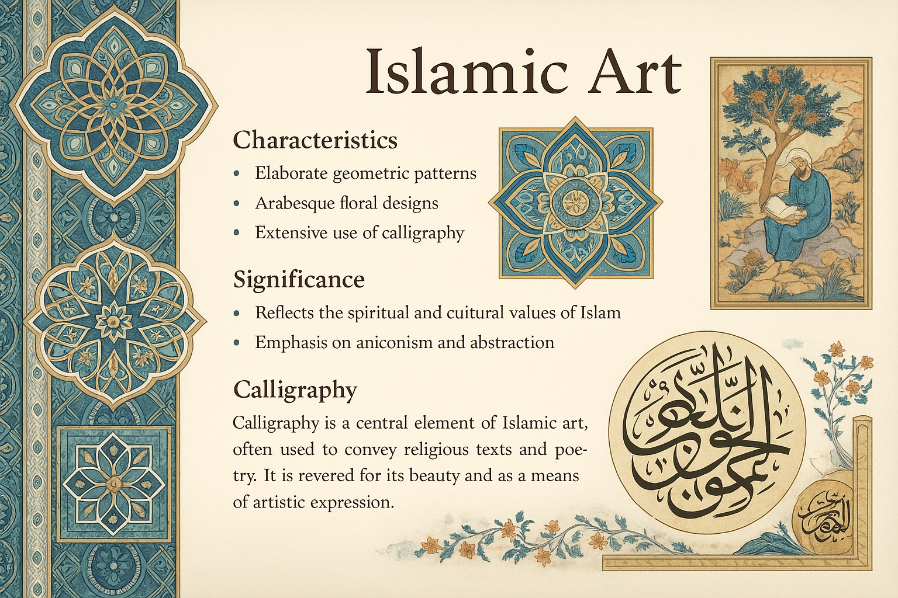

# 
GPT-4o-Image-Generation-for-OCR🚀

  
  

GPT-4o can now [generate images natively](https://openai.com/index/introducing-4o-image-generation/). This repository is about evaluating GPT-4o’s image generation capability on various **Optical Character Recognition (OCR)** tasks. The evaluation include **generating** multiple types of text images (handwritten notes, printed documents, poster, street signs, historical manuscript, etc.) and **editing** specific content of text images. Welcome **issues, PR, and stars** for more comprehensive testing or join us to uncovering the potential of GPT-4o for next-gen OCR applications! ✨

## 
:book:Content
 <!-- omit in toc -->

- [Slide Image](#slide-image)
- [Document Image](#document-image)
  - [Document Dewarping](#document-dewarping)
  - [Document Deshadowing](#document-deshadowing)
  - [Appearance Enhancement](#appearance-enhancement)
- [Handwritten Text Image](#handwritten-text-image)
- [Artistic Text Image](#artistic-text-image)
- [Scene Text Image](#scene-text-image)

## 
:milky_way:Slide Image
 <!-- omit in toc -->

| Prompt                                                       | Language | Output Image                                                 |
| ------------------------------------------------------------ | -------- | ------------------------------------------------------------ |
| A highly detailed and visually rich PowerPoint slide in a modern and professional style, featuring a bold English title at the top, multiple content blocks with varied font sizes including bullet points, short paragraphs, and highlighted keywords. The slide includes colorful icons, infographic-style illustrations, and a blend of clean vector graphics with hand-drawn sketch elements. A vertical sidebar shows a step-by-step process or timeline, and a small pie chart or data visualization is placed in one corner, labeled in English. The background is subtle, with a soft gradient or abstract texture that enhances readability without distraction. The overall layout is well-balanced, with clear structure, effective use of whitespace, and a harmonious color palette. The slide should appear as a fully finished presentation page with meaningful English content, refined typography, and polished visual composition. | EN       | 

 |
| Generate a visually stunning and informative PowerPoint slide. The slide should be meticulously designed with a sophisticated layout, incorporating a diverse range of elements.  Text: Include well-written, concise English text in a professional font (e.g., Arial, Calibri, Times New Roman). The text should be logically organized and easy to read, with a clear title and supporting bullet points or short paragraphs. Illustrations: Integrate intricate patterns, detailed drawings, and artistic paintings. These visual elements should be relevant to the text and enhance the overall message of the slide. Consider using a consistent color palette to create a harmonious aesthetic. Layout: The slide should have a balanced and visually appealing layout. Experiment with different arrangements of text and images to create a dynamic and engaging design. Use whitespace effectively to avoid clutter. Details: Pay attention to fine details such as shadows, gradients, and textures to add depth and realism to the image. The overall impression should be one of high quality and professionalism. | EN       | 

 |
| 一张视觉精美、信息丰富的长方形PPT幻灯片，主题为“未来科技与智能城市”。风格现代、科技感十足，整体排版清晰、专业，结构完整。幻灯片顶部是用中文写成的大标题“未来科技的城市图景”，使用无衬线字体，醒目现代。页面中部包含多个内容区域，展示有关智能交通系统、自动驾驶、物联网（IoT）、5G 网络基础设施等信息，每个部分配有简洁的中文段落说明和要点列表，如“智慧交通”、“数据中心”、“无人配送系统”等关键词以加粗或高亮方式呈现。页面中配有简洁清晰的图标、线条风格的插图、未来城市的建筑草图、以及科技设备的概念图。右下角是一个中文标注的数据图表（如柱状图或环形图）。背景为深蓝或渐变色调，带有抽象科技纹理。整体配色高对比，布局平衡有序，图文并茂，幻灯片应为完整内容，不能有留白或模板感。 | ZH       | 

 |

## 
📄Document Image
 <!-- omit in toc -->

#### Document Dewarping

| Input Image                                                  | Prompt                                                       | Language | Output Image                                                 |
| ------------------------------------------------------------ | ------------------------------------------------------------ | -------- | ------------------------------------------------------------ |
| 

 | Please perform dewarping on this document to make it flat and clear. | EN       | 

 |
| 

 | Please perform dewarping on this document to make it flat and clear. | EN       | 

 |
| 

 | 请帮我把这张图片中的文档矫正成一张平铺、清晰的文档           | ZH       | 

 |
| 

 | 裁剪出演唱会的票           | ZH       | 

 |
| 

 | 裁剪出票据           | ZH       | 

 |

#### Document Deshadowing

| Input Image                                                  | Prompt                         | Language | Output Image                                                 |
| ------------------------------------------------------------ | ------------------------------ | -------- | ------------------------------------------------------------ |
| 

 | 请帮我去掉这张文档图片中的阴影 | EN       | 

 |
| 

 | Process this document image to eliminate shadow artifacts and produce a clean, evenly lit version. | LA       | 

 |
#### Appearance Enhancement

| Input Image                                                  | Prompt                                            | Language | Output Image                                                 |
| ------------------------------------------------------------ | ------------------------------------------------- | -------- | ------------------------------------------------------------ |
| 

 | 请帮我增强这张文档图像，输出一个类似pdf的清晰文档 | ZH       | 

 |

#### Text Editing

| Input Image                                                  | Prompt                                                       | Language | Output Image                                                 |
| ------------------------------------------------------------ | ------------------------------------------------------------ | -------- | ------------------------------------------------------------ |
| 

 | Please change the text "Stage 1: Domain-Specific Categorization" into "This is a paper of Qwen2.5-VL" | EN       | 

 |
| 

 | change "7.30pm" to "11.45 am" | EN       | 

 |
| 

 | 帮我将图中的“人工智能”改为“深度学习”，“PyTorch”改为“TensorFlow” | ZH       | 

 |
| 

 | 将价格改为21.88 | ZH       | 

 |

## 
📜Handwritten Text Image
 <!-- omit in toc -->

### T2I Generation

#### Paragraph Level

| Prompt                                                       | Language | Output Image                                                 |
| ------------------------------------------------------------ | -------- | ------------------------------------------------------------ |
| 请给我生成一张手写文字图片，内容是“ICDAR是文档分析与识别领域的顶级会议。在数字化转型时代，这一领域的重要性日益凸显。该旗舰会议的第19届将于2025年9月16日至21日在中国武汉举行。”，要求书写风格潦草。 | ZH       | 

 |

#### Line Level

| Prompt                                                       | Language | Output Image                                                 |
| ------------------------------------------------------------ | -------- | ------------------------------------------------------------ |
| Please generate an image with handwritten text that says: "OpenCV is open source, contains over 2500 algorithms, and is operated by the non-profit Open Source Vision Foundation." The handwriting style should be scribbled. | EN       | 

 |

#### Character (Font) Level

| Prompt                                       | Language | Output Image                                                 |
| -------------------------------------------- | -------- | ------------------------------------------------------------ |
| Please generate a handwritten character "P". | EN       | 

 |
| 生成一个手写汉字“天”，风格任意               | ZH       | 

 |

#### Interleaved Image-Text

| Prompt                                                       | Language | Output Image                                                 |
| ------------------------------------------------------------ | -------- | ------------------------------------------------------------ |
| Generate a hand-drawn physics diagram illustrating the law of reflection: 1. A flat horizontal surface representing a mirror. 2. An incident ray approaching the surface at an angle, drawn with an arrow. 3. A reflected ray bouncing off the surface symmetrically, also with an arrow. 4. A normal line drawn perpendicular to the surface at the point of incidence. 5. Clear angle markings: the angle of incidence (labeled as θᵢ) and the angle of reflection (labeled as θᵣ) 6. Degree values annotated next to the angles (e.g., 45°). 7. Dashed lines used as angle guides (from rays to the normal). 8. All elements labeled with clean, handwriting-style text. 9. Overall style: hand-drawn, minimalistic, like a whiteboard or notebook sketch. 10. Background: plain white or paper texture; no photographic elements. | EN       | 

 |

### Text Editing

#### Page Level

| Input Image                                                  | Prompt                                                 | Language | Output Image                                                 |
| ------------------------------------------------------------ | ------------------------------------------------------ | -------- | ------------------------------------------------------------ |
| 

 | Erase text "Football, cricket, running" in this image. | EN       | 

 |

#### Paragraph Level

| Input Image                                                  | Prompt                                                   | Language | Output Image                                                 |
| ------------------------------------------------------------ | -------------------------------------------------------- | -------- | ------------------------------------------------------------ |
| 

 | 请将文字“演讲的力量”修改为“讲话的力量”。其他文字保持不变 | ZH       | 

 |

#### Line Level

| Input Image                                                  | Prompt                                      | Language | Output Image                                                 |
| ------------------------------------------------------------ | ------------------------------------------- | -------- | ------------------------------------------------------------ |
| 

 | Change "similarities" to "functionalities". | EN       | 

 |

### Handwritten Text Removal

#### Paragraph Level

| Input Image                                                  | Prompt                                     | Language | Output Image                                                 |
| ------------------------------------------------------------ | ------------------------------------------ | -------- | ------------------------------------------------------------ |
| 

 | 请擦除这张图片中所有的手写笔迹             | ZH       | 

 |
| 

 | 将"高考加油鸭"这句话擦除                   | ZH       | 

 |
| 

 | Remove all handwritten text in this image. | EN       | 

 |

### Style Transfer

| Input Image                                                  | Prompt                                                   | Language | Output Image                                                 |
| ------------------------------------------------------------ | -------------------------------------------------------- | -------- | ------------------------------------------------------------ |
| 

 | 参照图中的汉字风格，生成“一起去旅行”这句话 | ZH       | 

 |
| 

 | 参照图中的汉字风格，生成“一起去旅行”这句话 | ZH       | 

 |

## 
📷Scene Text Image
 <!-- omit in toc -->

### T2I Generation

| Prompt                                                       | Language | Output Image                                                 |
| ------------------------------------------------------------ | -------- | ------------------------------------------------------------ |
| Create a street sign image with text "Tomorrow".             | EN       | 

 |
| A bustling cyberpunk night market in a futuristic Asian metropolis, glowing with neon signs in multiple languages (Chinese, Japanese, Korean, Arabic, and English). The scene is filled with dense fog, reflections on wet pavement, flying cars above, and diverse crowds walking under neon umbrellas. Holographic advertisements float in the air, including a large glowing sign that reads "梦境集市" ("Dream Bazaar") in stylized Chinese calligraphy. Other floating signs display dynamic digital text such as "Now Open!", "未来食品", and "Quantum Noodles". The atmosphere is vibrant, chaotic, and immersive, with dramatic lighting and cinematic composition. Ultra-detailed, 4K, concept art style, with a blend of Blade Runner and Ghost in the Shell aesthetics. | Mixed    | 

 |

### Text Editing

| Input Image                                                  | Prompt                                          | Language | Output Image                                                 |
| ------------------------------------------------------------ | ----------------------------------------------- | -------- | ------------------------------------------------------------ |
| 

 | Change "2011" to "3120" and "MAPLES" to "LEAF". | EN       | 

 |

### Scene Text Removal

| Input Image                                                  | Prompt                           | Language | Output Image                                                 |
| ------------------------------------------------------------ | -------------------------------- | -------- | ------------------------------------------------------------ |
| 

 | Erase the "BEACH" in this image. | EN       | 

 |
| 

 | Erase all text in this image.    | EN       | 

 |

## 
:rainbow:Artistic Text Image
 <!-- omit in toc -->

### T2I Generation

#### Line Level

| Prompt                                                       | Language | Output Image                                                 |
| ------------------------------------------------------------ | -------- | ------------------------------------------------------------ |
| Generate a line of artistic text with intricate details, creative typography, and visual appeal, ensuring that each character has a different color. The font should have a unique aesthetic, incorporating elegant curves, bold strokes, or decorative elements. The text content should be: 'OpenCV is open source, contains over 2500 algorithms, and is operated by the non-profit Open Source Vision Foundation.' | EN       | 

 |
| 生成一行具有复杂细节、创意排版和视觉吸引力的艺术文本，要求每一个文字的颜色都不相同，字体应具有独特的美感，融入优雅的曲线、粗犷的笔触或装饰元素。文本的内容为“生活就像海洋，只有意志坚强的人才能到达彼岸”。 | ZH       | 

 |
| 生成一行具有复杂细节、创意排版和视觉吸引力的艺术文本，要求每一个文字的颜色都不相同，字体应具有独特的美感，融入优雅的曲线、粗犷的笔触或装饰元素。文本的内容为“龒厵䨫巴邑䶕脀勧忄”。 | ZH       | 

 |

#### Character (Font) Level

| Prompt                                | Language | Output Image                                                 |
| ------------------------------------- | -------- | ------------------------------------------------------------ |
| Please generate an artistic font "A". | EN       | 

 |
| 请生成一个艺术字，内容为“瀧”。        | ZH       | 

 |

## 
Contact
 <!-- omit in toc -->

eeprzhang@mail.scut.edu.cn

## 
Acknowledgement<!-- omit in toc -->

[Peirong Zhang🐲](https://github.com/NiceRingNode), [Haowei Xu🔥](https://github.com/shallweiwei), [Guitao Xu😿](https://github.com/guitaoxu).

[DLVC-Lab, South China University of Technology](https://github.com/SCUT-DLVCLab)
