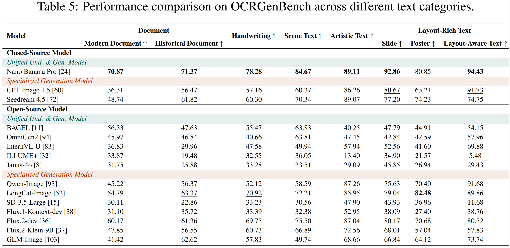
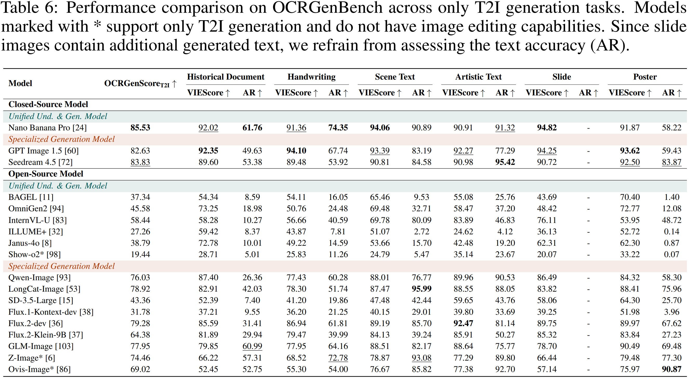
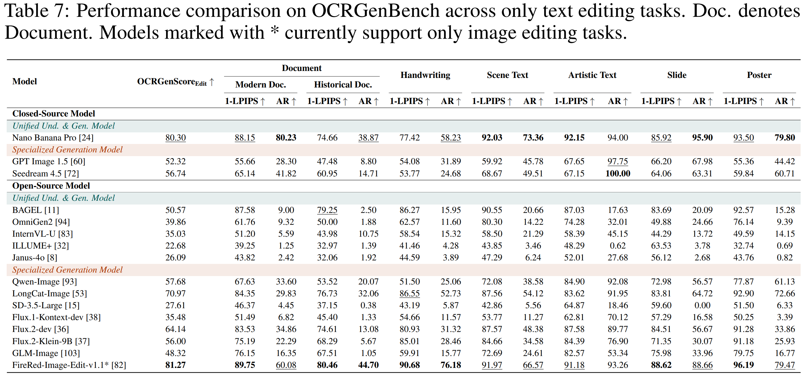
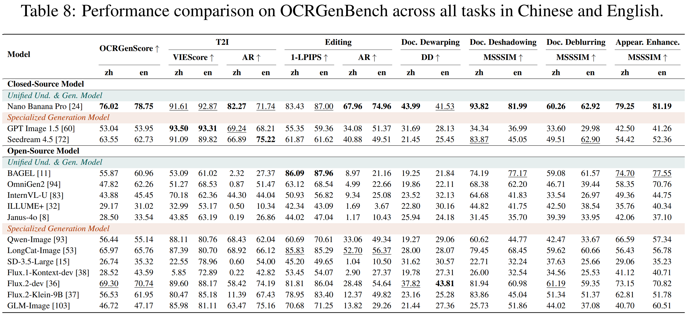
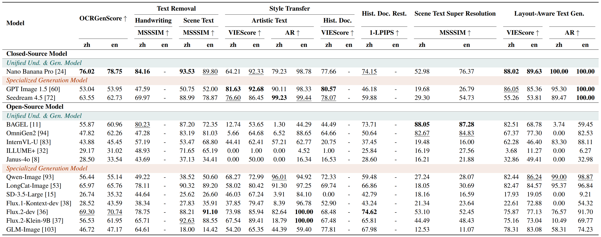

# <div align="center" id="awesome image generators">OCRGenBench: A Comprehensive Benchmark for Evaluating OCR Generative Capabilities🚀</div>

<div align="center">
  <a href="http://dlvc-lab.net/lianwen/"> </a>
  <a href="https://arxiv.org/abs/2507.15085"> </a>
  <a href="https://huggingface.co/papers/2507.15085"> </a>
  <a href="./LICENSE"> </a>
<p></p>
 

<p align="center">
    
</p>

<a href="https://arxiv.org/abs/2507.15085"> <b>OCRGenBench: A Comprehensive Benchmark for Evaluating OCR Generative Capabilities</b> </a>

</div>

**OCRGenBench** is the most comprehensive benchmark to date for evaluating the OCR generative capabilities of generative models. It pioneers in the unification of T2I generation, text editing, and OCR-related image-to-image translation to universally reflect a model's visual text synthesis abilities, *i.e.*, OCR generative capabilities. The benchmark covers 5 common text categories and 33 OCR generative tasks, including 1,060 challenging, human-annotated samples with dense text, varied layouts, multiple aspect ratios, and bilingual content. We also design a unified metric OCRGenScore, assessing text accuracy, instruction following, visual quality, and structural consistency in visual text synthesis.

> *This repository was formerly known as **Awesome Generative Models for OCR**, and included only the empirical evaluation of image generation capabilities of 7 models. Now we expand empirical evaluation to a **benchmark** and an evaluation framework, facilitating reproducible evaluation on unlimited models.*

# <div align="center" id="news"> 📃News</div> <!-- omit in toc -->

### 📌Pinned

- :tada: **[March 2026]​** We propose **OCRGenBench**, a comprehensive benchmark to evaluate multi-dimensional OCR generative capabilities (visual text synthesis capbilities).

- :tada: **[August 2025]** We have included the evaluation of [Qwen-Image](https://github.com/QwenLM/Qwen-Image), and the results will be soon upated to the paper.

- :tada: **[July 2025]** Our [paper](https://arxiv.org/abs/2507.15085) is online at arXiv! Welcome citation and star if you found our work useful! :blush:

- :fire: **[June 2025]** Expanded evaluation now includes various closed-source and **open-source** models!

- 📢 **[March 2025]** Initial evaluation of GPT-4o's image generation capabilities now available!

## <div align="center" id="citation">🍺Data Categorization</div><!-- omit in toc -->

OCRGenBench encompasses five major text scenarios and 33 OCR generative tasks (including T2I generation, text editing, and OCR I2I translation tasks). The categorization is shown below:


## <div align="center" id="citation">🍨Data Distribution</div><!-- omit in toc -->

OCRGenBench includes 1,060 high quality, manually annotated samples, whose distribution is shown as follows:


## <div align="center" id="citation">🎓Leaderboard</div><!-- omit in toc -->

> **Performance across task (main leaderboard)**


---
> Performance across text categories


---
> Performance across different T2I generation tasks


---
> Performance across different text editing tasks


---
> Performance across different tasks in Chinese and English





## <div align="center" id="citation">📋Citation</div> <!-- omit in toc -->

If you find our work helpful, please cite our paper:

```bibtex
@article{zhang2025ocrgenbench,
  title={{OCRGenBench: A Comprehensive Benchmark for Evaluating OCR Generative Capabilities}},
  author={Zhang, Peirong and Xu, Haowei and Zhang, Jiaxin and Zheng, Xuhan and Xu, Guitao and Zhang, Yuyi and Liu, Junle and Yang, Zhenhua and Zhou, Wei and Jin, Lianwen},
  journal={arXiv preprint arXiv:2507.15085},
  year={2025}
}
```

## <div align="center" id="contact">:e-mail:Contact</div> <!-- omit in toc -->

eeprzhang@mail.scut.edu.cn

## <div align="center" id="acknowledgement">🌊Acknowledgement<!-- omit in toc -->

Copyright 2025-2026, [Deep Learning and Vision Computing (DLVC) Lab](http://www.dlvc-lab.net), South China China University of Technology.

## <div align="center" id="star">⭐Star History<!--omit in toc -->

[](https://star-history.com/#NiceRingNode/Awesome-Generative-Models-for-OCR&Timeline)


