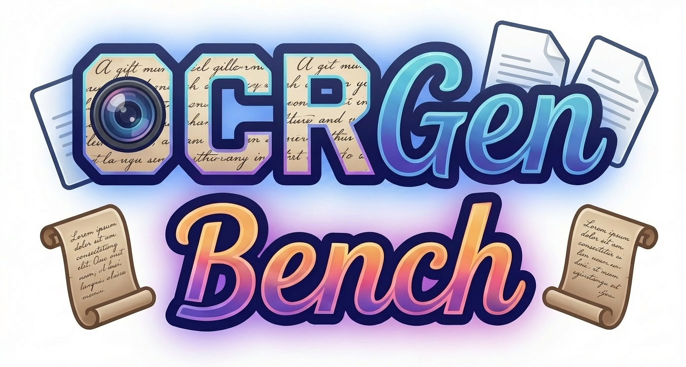
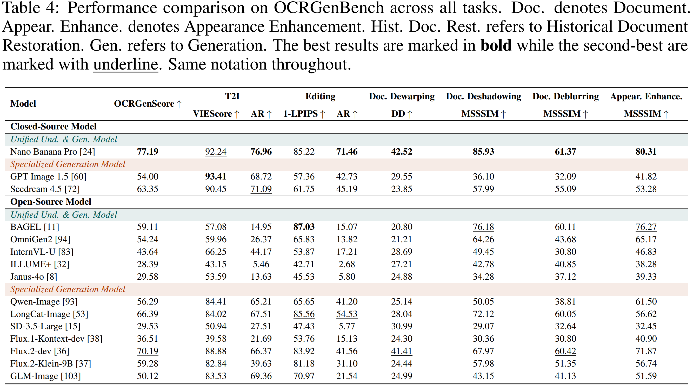
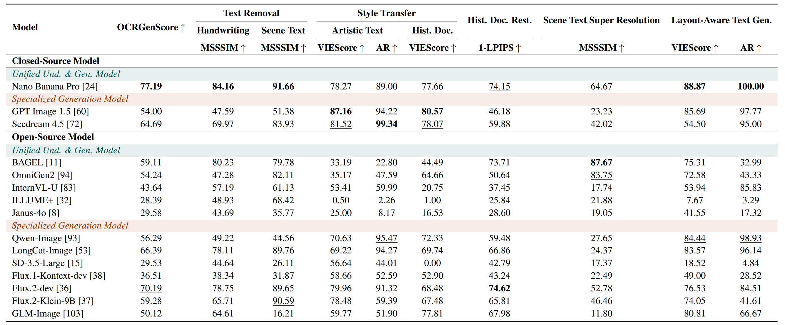

# <div align="center" id="ocrgenbench">OCRGenBench: A Comprehensive Benchmark for Evaluating OCR Generative Capabilities</div>

<div align="center">
  <a href="http://dlvc-lab.net/lianwen/"></a>
  <a href="https://arxiv.org/abs/2507.15085"></a>
  <a href="https://huggingface.co/PeirongZhang/OCRGenBench"></a>
  <a href="https://niceringnode.github.io/Awesome-Generative-Models-for-OCR/leaderboard/"></a>
  <a href="./LICENSE"></a>
<p></p>


<p align="center">
  
</p>

</div>

**OCRGenBench** is the most comprehensive benchmark to date for evaluating the OCR generative capabilities of generative models. It pioneers the unification of text-to-image (T2I) generation, text editing, and OCR-related image-to-image (I2I) translation to comprehensively reflect a model's visual text synthesis abilities — referred to as *OCR generative capabilities*. The benchmark covers 5 common text categories and 33 OCR generative tasks, comprising 1,060 challenging, human-annotated samples with dense text, varied layouts, multiple aspect ratios, and bilingual content. We additionally introduce a unified evaluation metric, **OCRGenScore**, which assesses text accuracy, instruction following, visual quality, and structural consistency in visual text synthesis.

> *This repository was formerly known as **Awesome Generative Models for OCR**, which included only an empirical evaluation of image generation capabilities across 7 models. We have since expanded it into a full **benchmark** and evaluation framework, enabling reproducible evaluation on an unlimited number of models.*

## <div align="center" id="news">📃 News</div> <!-- omit in toc -->

### 📌 Pinned

- 🚀 **[March 2026]** Our **online leaderboard** is now live: [OCRGenBench Leaderboard](https://niceringnode.github.io/Awesome-Generative-Models-for-OCR/leaderboard/).

- 🎉 **[March 2026]** We propose **OCRGenBench**, a comprehensive benchmark for evaluating multi-dimensional OCR generative capabilities (visual text synthesis capabilities).

- 🎉 **[August 2025]** Evaluation of [Qwen-Image](https://github.com/QwenLM/Qwen-Image) has been added; results are updated in the paper.

- 🎉 **[July 2025]** Our [paper](https://arxiv.org/abs/2507.15085) is available on arXiv! Citations and stars are welcome if you find our work useful. 😊

- 🔥 **[June 2025]** Expanded evaluation now includes a diverse set of closed-source and **open-source** models!

- 📢 **[March 2025]** Initial evaluation of GPT-4o's image generation capabilities is now available!

## <div align="center" id="environment">🍺 Environment</div> <!-- omit in toc -->

```bash
git clone https://github.com/NiceRingNode/Awesome-Generative-Models-for-OCR.git
cd Awesome-Generative-Models-for-OCR
conda create -n ocrgen python=3.11.8
conda activate ocrgen
pip install -r requirements.txt
```

## <div align="center" id="evaluation">🚀 Run Evaluation</div> <!-- omit in toc -->

The evaluation pipeline consists of two stages: **generating result images** and **computing metrics**.

### ⚒️ Data Preparation

Download the OCRGenBench benchmark from [HuggingFace](https://huggingface.co/datasets/PeirongZhang/OCRGenBench).

Generate the data specification file `data/test_cases.json` using:

```bash
python process.py
```

The resulting `data/test_cases.json` follows this format:

```json
[
    {
        "id": 0,
        "field": "slide",
        "task": "T2I",
        "prompt": "...",
        "input_image_path_1": null,
        "input_image_path_2": null,
        "task_type": "generation",
        "output_path": "./output/holder/slide/T2I/1.png"
    },
    ...
]
```

### 🖼️ Generating Result Images

#### Generating Images from Open-Source Models

1. Download pretrained weights from HuggingFace using `download.py`. Model weights will be saved under `models/`.

```bash
python download.py --repo huggingface/model_name
```

2. Create a directory for your model and define a dedicated `__init__.py`. In this file, implement a T2I generation function `xxx_generate_func` and an image editing function `xxx_edit_func`. The following example uses `Longcat-Image`:

```bash
mkdir longcat
cd longcat
touch __init__.py
```

3. In `__init__.py`, implement the two interface functions:

```python
def longcat_generate_func(input_prompt=None):
    ...

def longcat_edit_func(input_prompt=None, input_image_path1=None, input_image_path2=None):
    ...
```

4. Register the functions in `inference.py`:

```python
generate_func, edit_func = None, None

def get_model_functions(model_name):
    global generate_func, edit_func
    if model_name == 'longcat':
        from longcat import longcat_generate_func as generate_func, longcat_edit_func as edit_func
    elif model_name == 'your_model_name':
        ...
```

5. Run inference:

```bash
CUDA_VISIBLE_DEVICES=0 python inference.py --model longcat
```

> Multiple GPUs can be used for inference if needed.

#### Generating Images from Closed-Source Models

We currently support `Nano Banana Pro`, `GPT-Image-1.5`, and `Seedream-4.5`. To evaluate these models or their variants (e.g., `Nano Banana 2`, `GPT-Image-1`, `Seedream-5.0`), set the corresponding API credentials:

```bash
export OPENAI_BASE_URL='https://xxx'
export OPENAI_API_KEY='sk-xxx'
```

or

```bash
export GEMINI_BASE_URL='https://xxx'
export GEMINI_API_KEY='sk-xxx'
```

Then run:

```bash
python inference_api.py --model gemini-3-pro-image-preview
```

Other closed-source models can be evaluated by following the same procedure and modifying `inference_api.py` accordingly.

### 📊 Computing Metrics

Export your OpenAI credentials for VIEScore, an LLM-as-Judge metric backed by `GPT-5`:

```bash
export OPENAI_BASE_URL='https://xxx'
export OPENAI_API_KEY='sk-xxx'
```

Compute all metrics with:

```bash
python eval.py --model model_name  # e.g., gemini-3-pro-image-preview
```

> **[Todo]** `eval.py` will soon support exporting `.xlsx` files for leaderboard submission.

## <div align="center" id="data-categorization">🌏 Data Categorization</div> <!-- omit in toc -->

OCRGenBench encompasses five major text scenarios and 33 OCR generative tasks, covering T2I generation, text editing, and OCR I2I translation. The full categorization is illustrated below:


## <div align="center" id="data-distribution">🍨 Data Distribution</div> <!-- omit in toc -->

OCRGenBench comprises 1,060 high-quality, manually annotated samples. Their distribution is shown below:


## <div align="center" id="leaderboard">🎓 Leaderboard</div> <!-- omit in toc -->

> **Performance by task (main leaderboard)**





---

> *View the full interactive leaderboard: [**OCRGenBench Leaderboard**](https://niceringnode.github.io/Awesome-Generative-Models-for-OCR/leaderboard/)*

## <div align="center" id="citation">📋 Citation</div> <!-- omit in toc -->

If you find our work helpful, please consider citing our paper:

```bibtex
@article{zhang2025ocrgenbench,
  title={{OCRGenBench: A Comprehensive Benchmark for Evaluating OCR Generative Capabilities}},
  author={Zhang, Peirong and Xu, Haowei and Zhang, Jiaxin and Zheng, Xuhan and Xu, Guitao and Zhang, Yuyi and Liu, Junle and Yang, Zhenhua and Zhou, Wei and Jin, Lianwen},
  journal={arXiv preprint arXiv:2507.15085},
  year={2025}
}
```

## <div align="center" id="contact">📧 Contact</div> <!-- omit in toc -->

For questions or collaborations, please reach out to: eeprzhang@mail.scut.edu.cn

## <div align="center" id="acknowledgement">🌊 Acknowledgement</div> <!-- omit in toc -->

We gratefully acknowledge the following open-source projects used for metric computation: [VIEScore](https://github.com/TIGER-AI-Lab/VIEScore) and [DocAligner-Distortion](https://github.com/ZZZHANG-jx/DocAligner-Distortion).

Copyright 2025–2026, [Deep Learning and Vision Computing (DLVC) Lab](http://www.dlvc-lab.net), South China University of Technology.

## <div align="center" id="star-history">⭐ Star History</div> <!-- omit in toc -->

[](https://star-history.com/#NiceRingNode/Awesome-Generative-Models-for-OCR&Timeline)
