# 
Awesome Image Generators for OCR Image Generation and Editing🚀

  
  

This repository is about evaluating state-of-the-art image generators’ generation and editing capability on various **Optical Character Recognition (OCR)** tasks, including both **closed-source** and **open-source** models. Currently, we have tested [GPT-4o](https://openai.com/index/introducing-4o-image-generation/), [Qwen-VLo](https://qwenlm.github.io/zh/blog/qwen-vlo/), [Flux.1-Kontext-dev](https://huggingface.co/black-forest-labs/FLUX.1-Kontext-dev), and [Janus-4o](https://huggingface.co/FreedomIntelligence/Janus-4o-7B). The evaluation include **generating** multiple types of text images (handwritten notes, printed documents, poster, street signs, historical manuscript, etc.) and **editing** specific content of text images. We aim to understand the boundaries of SOTA image generation models applied to the specialized field of OCR, identify remaining challenges, and explore **how close we are to achieving AGI-level capabilities in this domain**.

> *This repository This repository was formerly known as **GPT-4o-Image-Generation-for-OCR**, and was used only to test the image generation capabilities of GPT-4o. Now we are expanding our evaluation to more models, especially **open-source models.***

Welcome **🌟issues, PR, and stars🌟** for more comprehensive testing or join us for more comprehensive evaluation!

# 
 📃News
 <!-- omit in toc -->

### 📌Pinned

- :fire: **[June 2025]** Expanded evaluation now includes various closed-source and **open-source** models!

-  📢 **[March 2025]** Initial evaluation of GPT-4o's image generation capabilities now available!

## 
 :gem:Observations
 <!-- omit in toc -->

## GPT-4o

**Tasks with Good Performance (few or no errors):**

- Text-to-Image (T2I) Generation (Handwritten text, scene text, slides or other creative graphics, ancient text, overlapping text and images)
- Text Super-Resolution, Text Style Transfer, Scene Text Removal

**Tasks with Marginal Performance (sometimes works, sometimes doesn't):**

- Handwritten Text Removal, Layout-Aware Text Generation

**Tasks Currently Unachievable:**

- Document Dewarping, Document Shadow Removal, Document Deblurring, Document Appearance Enhancement
- Historical Document Restoration, Historical Document Style Transfer
- [Ordered Text Generation](https://github.com/NiceRingNode/GPT-4o-Image-Generation-for-OCR?tab=readme-ov-file#object-with-naturally-embedded-text) (Generating text like 0, 1, 2, ...)

**Technical Characteristics:**

1. GPT-4o excels at generating **creative and design-oriented images with text**, such as slides and street scenes, when given detailed prompts.
2. GPT-4o generates images with dimensions that are multiples of 512 pixels. Therefore, in tasks requiring image inputs (text editing, document dewarping, etc.), it mostly **fails to maintain the original image's aspect ratio** and incorrectly outputs images as **square**.

 

Click to view detailed observations of GPT-4o's evaluation.

3. Excellent at generating English text, but the accuracy of Chinese character generation is low. Only larger Chinese characters are generated accurately; **smaller Chinese characters are almost completely incorrect**.

4. Can generate simplified Chinese characters but cannot generate [complex Chinese characters](https://github.com/NiceRingNode/GPT-4o-Image-Generation-for-OCR?tab=readme-ov-file#object-with-naturally-embedded-text).
5. When performing image editing, the unedited parts of the image **can not be accurately replicated** and are often accompanied by **cropping, expansion, sharpening, detail changes, etc.**
6. In tasks involving image input, if the image contains dense text, the text in the output image is likely to be **severely garbled** (e.g., document rectification, document shadow removal, historical document restoration, historical document style transfer).
7. In tasks involving image input, if the image itself contains embedded graphics, **the embedded graphics cannot be restored** in the output (e.g., document rectification).
8. Most likely does not use OCR to recognize text and then re-render it.

## Qwen-VLo

**Technical Characteristics:**

1. The reliance (e.g., weights during generation) on previous history is too heavy, leading to poor instruction following sometimes.

2. Unable to smartly identify user intension of generating images or textual response. For example, when prompted to “remove all handwritten text in this image” (left), it provides a step-by-step textual explanation rather than producing the edited image. Only when explicitly instructed to “output the resulted image” (right) does the model generate the visual result users actually need.

  
  

3. It fails to render a large amount of text, no matter English or Chinese. Few successful cases.
4. Poor instruction following ability. For instance, the model output squared images given the instruction of outputting rectangle images. It outputs a book page given the instruction of generating a slide.

## Flux.1-Kontext-dev

**Technical Characteristics:**

1. The model can partially handle English image generation or editing, whereas fails to perform Chinese image generation.
2. It mostly **fails to maintain the original image's aspect ratio** and incorrectly outputs images as **square**. We did not find any parameters to control original size preserved generation. However, in the official website of [Flux.AI](https://flux1.ai/flux-kontext), the user can select “match input” as the output image’s dimension. We are looking into this.

## Janus-4o

**Technical Characteristics:**

Janus-4o nearly has no text rendering ability in terms of either English or Chinese text, potentially due to its small model size (7B). 

## 
:book:Content
 <!-- omit in toc -->

- [Slide Image](#slide-image)
- [Modern Document Image](#modern-document-image)
  - [Document Dewarping](#document-dewarping)
  - [Document Deshadowing](#document-deshadowing)
  - [Document Deblur](#document-deblur)
  - [Appearance Enhancement](#appearance-enhancement)
  - [Text Editing](#text-editing)
- [Historical Document Image](#historical-document-image)
  - [T2I Generation](#t2i-generation)
  - [Text Editing](#text-editing-1)
  - [Historical Document Restoration](#historical-document-restoration)
  - [Style Transfer](#style-transfer)
  - [Super Resolution](#super-resolution)
- [Handwritten Text Image](#handwritten-text-image)
  - [T2I Generation](#t2i-generation-1)
    - [Paragraph Level](#paragraph-level)
    - [Line Level](#line-level)
    - [Character (Font) Level](#character-font-level)
    - [Interleaved Image-Text](#interleaved-image-text)
  - [Text Editing](#text-editing-2)
    - [Page Level](#page-level)
    - [Paragraph Level](#paragraph-level-1)
    - [Line Level](#line-level-1)
  - [Handwritten Text Removal](#handwritten-text-removal)
    - [Paragraph Level](#paragraph-level-2)
- [Scene Text Image](#scene-text-image)
  - [T2I Generation](#t2i-generation-2)
  - [Text Editing](#text-editing-3)
  - [Scene Text Removal](#scene-text-removal)
- [Object with Naturally Embedded Text](#object-with-naturally-embedded-text)
  - [T2I Generation](#t2i-generation-3)
  - [Text Editing](#text-editing-4)
- [Artistic Text Image](#artistic-text-image)
  - [T2I Generation](#t2i-generation-4)
    - [Line Level](#line-level-2)
    - [Character (Font) Level](#character-font-level-1)
    - [Style Transfer](#style-transfer-1)

- [Layout-aware Text Generation](#layout-aware-text-generation)

  <h2>🌌Slide Image</h2>

<table border="1" align="center" style="width: 100%; text-align: left;">
  <thead>
    <tr>
      <th>Prompt</th>
      <th>Language</th>
      <th>Method</th>
      <th>Output Image</th>
      <th>Assessment</th>
    </tr>
  </thead>
  <tbody>
    <tr>
      <td rowspan="3">A highly detailed and visually rich PowerPoint slide in a modern and professional style, featuring a bold English title at the top, multiple content blocks with varied font sizes including bullet points, short paragraphs, and highlighted keywords. The slide includes colorful icons, infographic-style illustrations, and a blend of clean vector graphics with hand-drawn sketch elements. A vertical sidebar shows a step-by-step process or timeline, and a small pie chart or data visualization is placed in one corner, labeled in English. The background is subtle, with a soft gradient or abstract texture that enhances readability without distraction. The overall layout is well-balanced, with clear structure, effective use of whitespace, and a harmonious color palette. The slide should appear as a fully finished presentation page with meaningful English content, refined typography, and polished visual composition.</td>
      <td rowspan="3">EN</td>
      <td>GPT-4o</td>
      <td></td>
      <td>✅ Most requirements fulfilled.</td>
    </tr>
    <tr>
      <td>Qwen-VLo</td>
      <td></td>
      <td>🤔 Partially fulfilled. Some texts are blurred.</td>
    </tr>
    <tr>
      <td>Janus-4o</td>
      <td>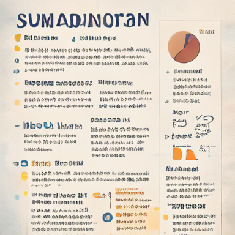</td>
      <td>🤔 Partially correct but totally failed text rendering.</td>
    </tr>
      <tr>
      <td rowspan="3">Generate a visually stunning and informative PowerPoint slide. The slide should be meticulously designed with a sophisticated layout, incorporating a diverse range of elements.  Text: Include well-written, concise English text in a professional font (e.g., Arial, Calibri, Times New Roman). The text should be logically organized and easy to read, with a clear title and supporting bullet points or short paragraphs. Illustrations: Integrate intricate patterns, detailed drawings, and artistic paintings. These visual elements should be relevant to the text and enhance the overall message of the slide. Consider using a consistent color palette to create a harmonious aesthetic. Layout: The slide should have a balanced and visually appealing layout. Experiment with different arrangements of text and images to create a dynamic and engaging design. Use whitespace effectively to avoid clutter. Details: Pay attention to fine details such as shadows, gradients, and textures to add depth and realism to the image. The overall impression should be one of high quality and professionalism.</td>
      <td rowspan="3">EN</td>
      <td>GPT-4o</td>
      <td></td>
      <td>🤔 Partially correct. Large text is good but smaller text is chaotic.</td>
    </tr>
    <tr>
      <td>Qwen-VLo</td>
      <td></td>
      <td>🤔 Partially correct. Smaller text is chaotic.</td>
    </tr>
    <tr>
      <td>Janus-4o</td>
      <td></td>
      <td>❌ Totally failed text rendering.</td>
    </tr>
    <tr>
      <td rowspan="3">一张视觉精美、信息丰富的长方形PPT幻灯片，主题为“未来科技与智能城市”。风格现代、科技感十足，整体排版清晰、专业，结构完整。幻灯片顶部是用中文写成的大标题“未来科技的城市图景”，使用无衬线字体，醒目现代。页面中部包含多个内容区域，展示有关智能交通系统、自动驾驶、物联网（IoT）、5G 网络基础设施等信息，每个部分配有简洁的中文段落说明和要点列表，如“智慧交通”、“数据中心”、“无人配送系统”等关键词以加粗或高亮方式呈现。页面中配有简洁清晰的图标、线条风格的插图、未来城市的建筑草图、以及科技设备的概念图。右下角是一个中文标注的数据图表（如柱状图或环形图）。背景为深蓝或渐变色调，带有抽象科技纹理。整体配色高对比，布局平衡有序，图文并茂，幻灯片应为完整内容，不能有留白或模板感。</td>
      <td rowspan="3">ZH</td>
      <td>GPT-4o</td>
      <td></td>
      <td>🤔 Partially correct. Large text is good but smaller text is chaotic.</td>
    </tr>
    <tr>
      <td>Qwen-VLo</td>
      <td></td>
      <td>🤔 Partially correct. Smaller text is chaotic.</td>
    </tr>
    <tr>
      <td>Janus-4o</td>
      <td>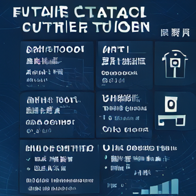</td>
      <td>🤔 Partially correct but totally failed text rendering.</td>
    </tr>
  </tbody>
</table>

<!-- Modern Document Image Section -->
### Document Dewarping

  <h2>📄Modern Document Image</h2>

<table border="1" align="center" style="width: 100%; text-align: left;">
  <thead>
    <tr>
      <th>Input Image</th>
      <th>Prompt</th>
      <th>Language</th>
      <th>Method</th>
      <th>Output Image</th>
      <th>Assessment</th>
    </tr>
  </thead>
  <tbody>
    <tr>
      <td rowspan="3"></td>
      <td rowspan="3">Please perform dewarping on this document to make it flat and clear.</td>
      <td rowspan="3">EN</td>
      <td>GPT-4o</td>
      <td></td>
      <td>⌠Texts are chaotic and blurred. Three columns become two columns.</td>
    </tr>
    <tr>
      <td>Qwen-VLo</td>
      <td></td>
      <td>🤔 Flat document but totally blurred text.</td>
    </tr>
    <tr>
      <td>Janus-4o</td>
      <td>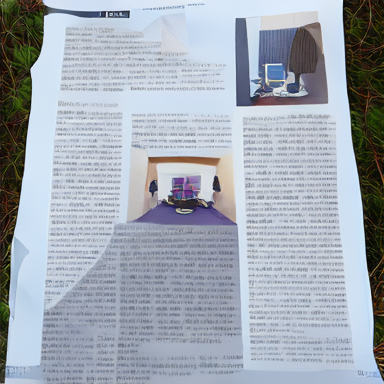</td>
      <td>⌠Totally failed and blurred text.</td>
    </tr>
    <tr>
      <td rowspan="3"></td>
      <td rowspan="3">Please perform dewarping on this document to make it flat and clear.</td>
      <td rowspan="3">EN</td>
      <td>GPT-4o</td>
      <td></td>
      <td>⌠Embedded drawing is not correctly restored. Partial Texts are blurred.</td>
    </tr>
    <tr>
      <td>Qwen-VLo</td>
      <td>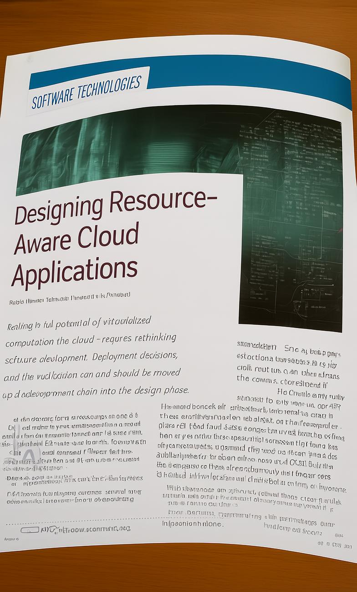</td>
      <td>⌠Not dewarpped. Large texts are clear but small ones are blurred.</td>
    </tr>
    <tr>
      <td>Janus-4o</td>
      <td></td>
      <td>⌠Totally failed and chaotic, blurred text.</td>
    </tr>
    <tr>
      <td rowspan="3"></td>
      <td rowspan="3">请帮我把这张图片中的文档矫正成一张平铺、清晰的文档</td>
      <td rowspan="3">ZH</td>
      <td>GPT-4o</td>
      <td></td>
      <td>❌ Only the large text is good. Small text is incompletely restored and blurred.</td>
    </tr>
    <tr>
      <td>Qwen-VLo</td>
      <td></td>
      <td>🤔 Flat document but totally incorrect text.</td>
    </tr>
    <tr>
      <td>Janus-4o</td>
      <td></td>
      <td>⌠Totally failed and entirely unseen text.</td>
    </tr>
    <tr>
      <td rowspan="2"></td>
      <td rowspan="2">裁剪出演唱会的票</td>
      <td rowspan="2">ZH</td>
      <td>GPT-4o</td>
      <td></td>
      <td>🤔 Direction is correct. The Chinese text is visual-like but meaningless.</td>
    </tr>
    <tr>
      <td>Qwen-VLo</td>
      <td></td>
      <td>⌠Totally wrong.</td>
    </tr>
    <tr>
      <td rowspan="2"></td>
      <td rowspan="2">裁剪出票据</td>
      <td rowspan="2">ZH</td>
      <td>GPT-4o</td>
      <td></td>
      <td>🤔 Only the large text is good. Small text is blurred or lacks semantic.</td>
    </tr>
    <tr>
      <td>Qwen-VLo</td>
      <td></td>
      <td>🤔 Only the large text is good. Small text is blurred or lacks semantic.</td>
    </tr>
  </tbody>
</table>

### Document Deshadowing

<table border="1" align="center" style="width: 100%; text-align: left;">
  <thead>
    <tr>
      <th>Input Image</th>
      <th>Prompt</th>
      <th>Language</th>
      <th>Method</th>
      <th>Output Image</th>
      <th>Assessment</th>
    </tr>
  </thead>
  <tbody>
    <tr>
      <td rowspan="3"></td>
      <td rowspan="3">请帮我去掉这张文档图片中的阴影</td>
      <td rowspan="3">EN</td>
      <td>GPT-4o</td>
      <td></td>
      <td>🤔 Shadow is removed. But the image is over-rectified.</td>
    </tr>
    <tr>
      <td>Qwen-VLo</td>
      <td></td>
      <td>🤔 Shadow is removed. But color is changed and text is blurred.</td>
    </tr>
    <tr>
      <td>Janus-4o</td>
      <td>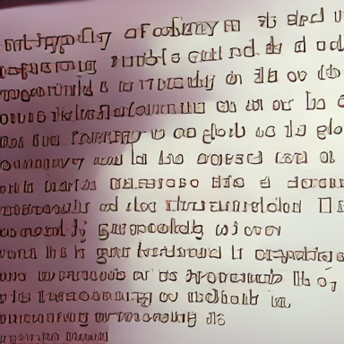</td>
      <td>⌠Totally failed and wrong color.</td>
    </tr>
    <tr>
      <td rowspan="2"></td>
      <td rowspan="2">Process this document image to eliminate shadow artifacts and produce a clean, evenly lit version.</td>
      <td rowspan="2">LA</td>
      <td>GPT-4o</td>
      <td></td>
      <td>🤔 Partially good. Shadows are removed. But texts are wrong.</td>
    </tr>
    <tr>
      <td>Qwen-VLo</td>
      <td></td>
      <td>🤔 Shadow removed. Text is blurred.</td>
    </tr>
  </tbody>
</table>

### Document Deblur
<table border="1" align="center" style="width: 100%; text-align: left;">
  <thead>
    <tr>
      <th>Input Image</th>
      <th>Prompt</th>
      <th>Language</th>
      <th>Method</th>
      <th>Output Image</th>
      <th>Assessment</th>
    </tr>
  </thead>
  <tbody>
    <tr>
      <td rowspan="2"></td>
      <td rowspan="2">Deblur this document image to enhance text clarity.</td>
      <td rowspan="2">EN</td>
      <td>GPT-4o</td>
      <td></td>
      <td>🤔 Partially good. Texts are clear but unwanted content has been automatically added.</td>
    </tr>
    <tr>
      <td>Qwen-VLo</td>
      <td></td>
      <td>⌠Clear but unreadable text.</td>
    </tr>
  </tbody>
</table>

### Appearance Enhancement
<table border="1" align="center" style="width: 100%; text-align: left;">
  <thead>
    <tr>
      <th>Input Image</th>
      <th>Prompt</th>
      <th>Language</th>
      <th>Method</th>
      <th>Output Image</th>
      <th>Assessment</th>
    </tr>
  </thead>
  <tbody>
    <tr>
      <td rowspan="3"></td>
      <td rowspan="3">请帮我增强这张文档图像，输出一个类似pdf的清晰文档</td>
      <td rowspan="3">ZH</td>
      <td>GPT-4o</td>
      <td></td>
      <td>🤔 Partially good. Enhanced appearance, but the table below wasn't in the input.</td>
    </tr>
    <tr>
      <td>Qwen-VLo</td>
      <td></td>
      <td>🤔 Enhanced appearance, but the text is blurred.</td>
    </tr>
    <tr>
      <td>Janus-4o</td>
      <td></td>
      <td>⌠Totally failed.</td>
    </tr>
  </tbody>
</table>

### Text Editing
<table border="1" align="center" style="width: 100%; text-align: left;">
  <thead>
    <tr>
      <th>Input Image</th>
      <th>Prompt</th>
      <th>Language</th>
      <th>Method</th>
      <th>Output Image</th>
      <th>Assessment</th>
    </tr>
  </thead>
  <tbody>
    <tr>
      <td rowspan="3"></td>
      <td rowspan="3">Please change the text "Stage 1: Domain-Specific Categorization" into "This is a paper of Qwen2.5-VL"</td>
      <td rowspan="3">EN</td>
      <td>GPT-4o</td>
      <td></td>
      <td>🤔 Modified successfully but some content is missing.</td>
    </tr>
    <tr>
      <td>Qwen-VLo</td>
      <td></td>
      <td>⌠Chaotic and unreadable text.</td>
    </tr>
    <tr>
      <td>Janus-4o</td>
      <td>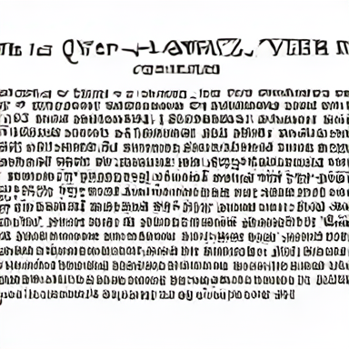</td>
      <td>⌠Totally failed and entirely unseen text.</td>
    </tr>
    <tr>
      <td rowspan="2"></td>
      <td rowspan="2">change "7.30pm" to "11.45 am"</td>
      <td rowspan="2">EN</td>
      <td>GPT-4o</td>
      <td></td>
      <td>🤔 Modified successfully, but some content is missing.</td>
    </tr>
    <tr>
      <td>Qwen-VLo</td>
      <td></td>
      <td>🤔 Modified successfully but some content is wrong.</td>
    </tr>
    <tr>
      <td rowspan="2"></td>
      <td rowspan="2">帮我将图中的“人工智能”改为“深度学习”，“PyTorch”改为“TensorFlow”</td>
      <td rowspan="2">ZH</td>
      <td>GPT-4o</td>
      <td></td>
      <td>🤔 Modified successfully, but some content is missing.</td>
    </tr>
    <tr>
      <td>Qwen-VLo</td>
      <td></td>
      <td>🤔 Modified successfully but some content is unreadable.</td>
    </tr>
    <tr>
      <td rowspan="2"></td>
      <td rowspan="2">将价格改为21.88</td>
      <td rowspan="2">ZH</td>
      <td>GPT-4o</td>
      <td></td>
      <td>🤔 Modified successfully but some content is missing.</td>
    </tr>
    <tr>
      <td>Qwen-VLo</td>
      <td></td>
      <td>⌠The number is wrong and some content is missing.</td>
    </tr>
  </tbody>
</table>

<!-- Historical Document Image Section -->

  <h2>📜Historical Document Image</h2>

### T2I Generation
<table border="1" align="center" style="width: 100%; text-align: left;">
  <thead>
    <tr>
      <th>Prompt</th>
      <th>Language</th>
      <th>Method</th>
      <th>Output Image</th>
      <th>Assessment</th>
    </tr>
  </thead>
  <tbody>
    <tr>
      <td rowspan="2">生成一页中国古代书籍，泛黄的旧纸张，竖排的中文毛笔书法，传统木刻印刷风格，精美的边框，纸张边缘磨损，有古旧质感，明清风格，高细节，写实光影，从上往下的视角</td>
      <td rowspan="2">ZH</td>
      <td>GPT-4o</td>
      <td>

</td>
      <td>✅ Requirements fulfilled.</td>
    </tr>
    <tr>
      <td>Qwen-VLo</td>
      <td>

</td>
      <td>⌠Chaotic and unreadable text.</td>
    </tr>
    <tr>
      <td rowspan="2">一张古籍书页的特写，纸张泛黄，带有明显的岁月痕迹。页面上书写着毛笔字，内容是《道德经》的第一章：“道可道，非常道；名可名，非常名。无名，天地之始；有名，万物之母。” 字迹工整，但部分笔画略有模糊。页面边缘有虫蛀的痕迹，并有一些墨迹晕染开来。背景是深色的木质书桌，桌面上散落着一些毛笔、砚台和镇纸。光线昏暗，从左上方照射下来，营造出一种古老而神秘的氛围。</td>
      <td rowspan="2">ZH</td>
      <td>GPT-4o</td>
      <td>

</td>
      <td>🤔 Most requirements are fulfilled but the content is incomplete and incorrect.</td>
    </tr>
    <tr>
      <td>Qwen-VLo</td>
      <td>

</td>
      <td>⌠Chaotic and unreadable text.</td>
    </tr>
    <tr>
      <td rowspan="2">生成三页连续的《史记·项羽本纪》古籍书页图片。书页采用明代风格，使用仿古宣纸，纸张略微泛黄，带有轻微的墨迹晕染。字体为工整的小楷，页面排版为传统的竖排版式，每页约20行，每行约15字。书页边缘有轻微的磨损和虫蛀痕迹，但整体保存完好。背景为深色木质书桌，桌面干净整洁，仅有一盏古朴的油灯提供照明。光线柔和，营造出一种宁静而庄重的氛围。请确保三页书页的风格、字体、纸张材质、墨迹晕染程度等细节保持高度一致，使它们看起来像是同一本书的连续页面。</td>
      <td rowspan="2">ZH</td>
      <td>GPT-4o</td>
      <td>

</td>
      <td>🤔 Most requirements fulfilled. But the content is not Chinese and its language is unidentified.</td>
    </tr>
    <tr>
      <td>Qwen-VLo</td>
      <td>

</td>
      <td>⌠Not consecutive pages and text lacks semantic.</td>
    </tr>
    <tr>
      <td rowspan="2">Generate a close-up image of an aged manuscript page written in English. The page is made of thick, parchment-like material, yellowed with age and showing subtle signs of wear and tear. The text is written in a formal, calligraphic script reminiscent of the 16th century, with ornate capital letters and flowing lines. The text on the page is an excerpt from Shakespeare's Hamlet, Act 1, Scene 2, starting with the line: "O, that this too too solid flesh would melt, Thaw and resolve itself into a dew!" and continuing for several lines. The page has faint water stains and minor ink smudges, adding to its aged appearance. The edges are slightly frayed and uneven. The background is a dark, out-of-focus surface, perhaps a wooden table or leather-bound book. The lighting is soft and diffused, creating a sense of antiquity and scholarly atmosphere. Ensure the script is legible but clearly handwritten, not a modern font. The overall impression should be that of a genuine historical document.</td>
      <td rowspan="2">EN</td>
      <td>GPT-4o</td>
      <td>

</td>
      <td>✅ Requirements fulfilled.</td>
    </tr>
    <tr>
      <td>Qwen-VLo</td>
      <td>

</td>
      <td>🤔 A historical document. The text seems not English.</td>
    </tr>
  </tbody>
</table>

### Text Editing
<table border="1" align="center" style="width: 100%; text-align: left;">
  <thead>
    <tr>
      <th>Input Image</th>
      <th>Prompt</th>
      <th>Language</th>
      <th>Method</th>
      <th>Output Image</th>
      <th>Assessment</th>
    </tr>
  </thead>
  <tbody>
    <tr>
      <td rowspan="3">

</td>
      <td rowspan="3">Modify "CONGRESS" to "COVERING".</td>
      <td rowspan="3">EN</td>
      <td>GPT-4o</td>
      <td>

</td>
      <td>✅ Requirements fulfilled despite super-resolution is accidentally performed.</td>
    </tr>
    <tr>
      <td>Qwen-VLo</td>
      <td>

</td>
      <td>🤔 Modification is correct. But some content is missing.</td>
    </tr>
    <tr>
      <td>Flux.1-Kontext-dev</td>
      <td>

</td>
      <td>⌠Totally failed.</td>
    </tr>
    <tr>
      <td rowspan="3">

</td>
      <td rowspan="3">将图片中的“所有不可得意界”修改成“今天天气很好”</td>
      <td rowspan="3">ZH</td>
      <td>GPT-4o</td>
      <td>

</td>
      <td>⌠Modifications incorrect and other texts are incorrect.</td>
    </tr>
    <tr>
      <td>Qwen-VLo</td>
      <td>

</td>
      <td>⌠Chaotic and unreadable text.</td>
    </tr>
    <tr>
      <td>Flux.1-Kontext-dev</td>
      <td>
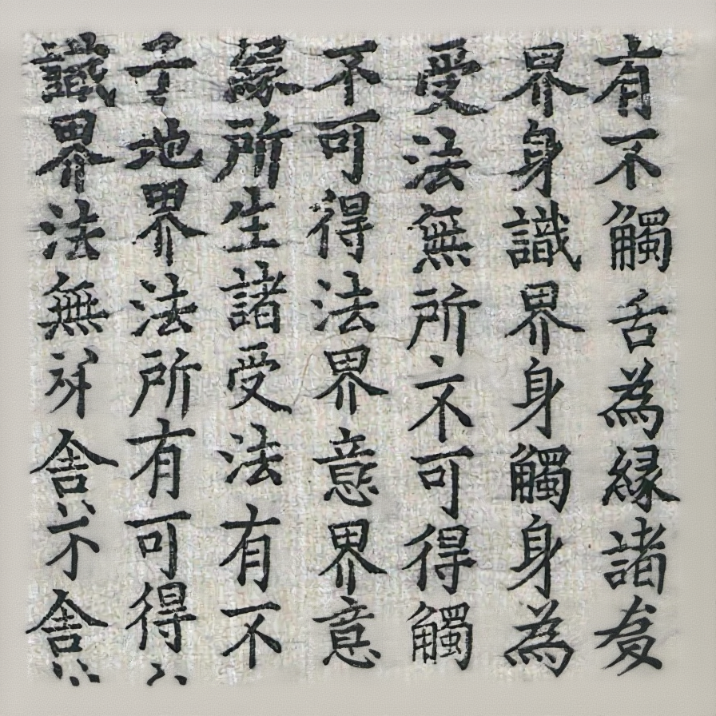
</td>
      <td>⌠Text is not modified.</td>
    </tr>
  </tbody>
</table>

### Historical Document Restoration
<table border="1" align="center" style="width: 100%; text-align: left;">
  <thead>
    <tr>
      <th>Input Image</th>
      <th>Prompt</th>
      <th>Language</th>
      <th>Method</th>
      <th>Output Image</th>
      <th>Assessment</th>
    </tr>
  </thead>
  <tbody>
    <tr>
      <td rowspan="2">

</td>
      <td rowspan="2">修复这张古籍图片中破损和缺失的文字</td>
      <td rowspan="2">ZH</td>
      <td>GPT-4o</td>
      <td>

</td>
      <td>⌠Restoration failed. Original content has been changed and incorrect background.</td>
    </tr>
    <tr>
      <td>Qwen-VLo</td>
      <td>

</td>
      <td>⌠Unreadable text.</td>
    </tr>
    <tr>
      <td rowspan="2">

</td>
      <td rowspan="2">修复这张古籍图片中破损和缺失的文字，保持文字风格相同以及背景一致</td>
      <td rowspan="2">ZH</td>
      <td>GPT-4o</td>
      <td>

</td>
      <td>⌠Restoration totally failed.</td>
    </tr>
    <tr>
      <td>Qwen-VLo</td>
      <td>
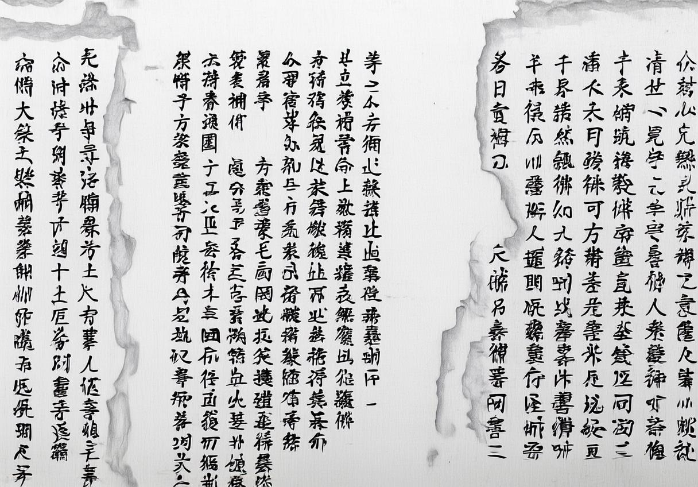
</td>
      <td>⌠Unreadable text and incorrect background.</td>
    </tr>
  </tbody>
</table>

### Style Transfer
<table border="1" align="center" style="width: 100%; text-align: left;">
  <thead>
    <tr>
      <th>Input Image 1</th>
      <th>Input Image 2</th>
      <th>Prompt</th>
      <th>Language</th>
      <th>Method</th>
      <th>Output Image</th>
      <th>Assessment</th>
    </tr>
  </thead>
  <tbody>
    <tr>
      <td rowspan="2">

</td>
      <td rowspan="2">

</td>
      <td rowspan="2">请将第二张古籍图片的风格迁移到第一张古籍上，包括背景颜色、字体样式、笔画粗细等等。</td>
      <td rowspan="2">EN</td>
      <td>GPT-4o</td>
      <td>

</td>
      <td>⌠Style and content are totally incorrect.</td>
    </tr>
    <tr>
      <td>Qwen-VLo</td>
      <td>

</td>
      <td>⌠Unreadable text and incorrect style.</td>
    </tr>
  </tbody>
</table>

### Super Resolution

<table border="1" align="center" style="width: 100%; text-align: left;">
  <thead>
    <tr>
      <th>Input Image</th>
      <th>Prompt</th>
      <th>Language</th>
      <th>Method</th>
      <th>Output Image</th>
      <th>Assessment</th>
    </tr>
  </thead>
  <tbody>
    <tr>
      <td rowspan="4">

</td>
      <td rowspan="4">Perform super-resolution on this image.</td>
      <td rowspan="4">EN</td>
      <td>GPT-4o</td>
      <td>

</td>
      <td>✅ Requirements fulfilled despite some texts are cropped.</td>
    </tr>
    <tr>
      <td>Qwen-VLo</td>
      <td>

</td>
      <td>some texts are unreadable .</td>
    </tr>
    <tr>
      <td>Flux.1-Kontext-dev</td>
      <td>
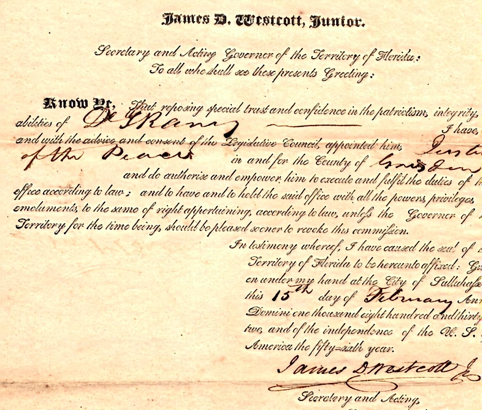
</td>
      <td>⌠Super resolution failed.</td>
    </tr>
    <tr>
      <td>Janus-4o</td>
      <td>

</td>
      <td>⌠Failed.</td>
    </tr>
  </tbody>
</table>

  <h2>:pencil2:Handwritten Text Image</h2>

### T2I Generation

#### Page Level
<table border="1" align="center" style="width: 100%; text-align: left;">
  <thead>
    <tr>
      <th>Prompt</th>
      <th>Language</th>
      <th>Method</th>
      <th>Output Image</th>
      <th>Assessment</th>
    </tr>
  </thead>
  <tbody>
    <tr>
      <td rowspan="2">A full page of handwritten study notes in neat cursive on lined paper, written in blue ink, containing the following text:  Chapter 4: Classical Mechanics and Newton's Laws Newton's Three Laws of Motion form the foundation of classical mechanics: First Law (Inertia): An object will remain at rest or in uniform motion unless acted upon by an external force. This principle explains why objects in space continue moving indefinitely. Second Law (F=ma): The acceleration of an object is directly proportional to the net force acting on it and inversely proportional to its mass. This relationship is expressed as F=ma, where: F represents the net force m represents the mass a represents acceleration  Third Law (Action-Reaction): For every action, there is an equal and opposite reaction. Examples include: Rocket propulsion Walking mechanics Recoil in firearms Key Applications in Real World: • Automotive design and safety • Sports biomechanics • Aerospace engineering • Structural design</td>
      <td rowspan="2">EN</td>
      <td>GPT-4o</td>
      <td></td>
      <td>✅ Well done!</td>
    </tr>
    <tr>
      <td>Qwen-VLo</td>
      <td></td>
      <td>⌠Unreadable text .</td>
    </tr>
 <tr>
  		<td rowspan="2">A handwritten journal entry in flowing handwriting with slight right slant, black ink on cream paper: September 15, 2024  Today marked my first week in Tokyo, and the city continues to amaze me at every turn. The morning began with a visit to the Tsukiji Outer Market, where the narrow alleys were already buzzing with activity by 7 AM. The aroma of grilled seafood and the calls of vendors created an atmosphere that felt both chaotic and perfectly orchestrated.  I managed to try tamago on a stick - a sweet Japanese omelet that melted in my mouth. The vendor, an elderly man with kind eyes, showed me how they carefully roll the eggs layer by layer. It's these small interactions that make traveling so meaningful.  In the afternoon, I explored the Yanaka district, one of Tokyo's oldest neighborhoods. The area survived the wartime bombings, preserving its traditional architecture and atmosphere. Small temples are tucked between modern homes, and cats roam freely through the quiet streets. I stopped at a local coffee shop where the owner has been roasting beans for over 40 years. Must remember to visit:  - Sensoji Temple at sunrise - Shimokitazawa for vintage shopping - Try the ramen place recommended by Mari - Book tea ceremony for next week</td>
  <td rowspan="2">EN</td>
  <td>GPT-4o</td>
  <td></td>
  <td>✅ Well done!</td>
</tr>
<tr>
  <td>Qwen-VLo</td>
  <td></td>
  <td>⌠Some texts are correct but most are unreadable .</td>
</tr>
<tr>
  <td rowspan="2">一页学生课堂笔记的照片，使用黑色中性笔书写的整页中文手写文字，字体为快速书写体，略带潦草但可辨识。笔记有标题、段落、要点突出，可能有下划线、圈注、箭头等标记。纸张为横格笔记本纸，顶部有日期与课程标题。文字密集，呈现真实的学习笔记风格。内容为：“【历史笔记】——中国古代政治制度（上）   一、宗法制与分封制 宗法制：以血缘关系维系的政治制度，核心是嫡长子继承制，确保家族权力的延续。 分封制：周天子将土地和人民分封给亲属、功臣建立诸侯国，诸侯需定期朝贡。  二、中央集权制度的确立 秦始皇统一中国后废分封、行郡县。郡县制由皇帝直接委派官员管理地方，形成中央集权雏形。  三、汉代的中外朝制度 汉武帝时设立“中朝”，由皇帝亲信掌权，引发外戚与宦官之争。外朝是传统官僚系统。   四、唐代三省六部制 中书省：起草政令；门下省：审议政令；尚书省：执行政令。六部分工明确：吏、户、礼、兵、刑、工。  五、宋代的文官体系 加强对军权的控制，设“枢密院”管理军政，官员由皇帝直接任命，中央权力进一步上升。   重点：从分封制到郡县制，是中国古代政治制度质的飞跃。”</td>
  <td rowspan="2">ZH</td>
  <td>GPT-4o</td>
  <td></td>
  <td>🤔 Partially good! But the image is cropped to square.</td>
</tr>
<tr>
  <td>Qwen-VLo</td>
  <td></td>
  <td>⌠Unreadable text .</td>
</tr>
<tr>
  <td rowspan="2">一张泛黄的信纸，上面用钢笔写满了整段中文手写文字，书写风格自然、连贯，略有修改痕迹，字迹工整但略显随性。信纸上文字从左上角起，整齐排列至底部，行距适中。纸张有轻微折痕，整体风格温暖真实。信件内容为：“亲爱的朋友：   你好呀！  写这封信的时候，窗外正飘着细细的春雨。空气里有青草的气息，像极了我们小时候一起在巷子里追逐打闹的日子。那时候无忧无虑，天总是那么蓝，笑声也特别清脆。  最近我在读一些老书，比如《围城》和《人间词话》，越读越觉得，人的一生最重要的不是成就，而是情感的落点。想到你，我就觉得温暖。我们虽然天各一方，但文字总能让彼此靠近。  希望你一切都好，生活顺利，心情舒畅。如果有空，记得回信哦！  此致   敬礼！  你的老朋友  林然   2023年4月”</td>
  <td rowspan="2">ZH</td>
  <td>GPT-4o</td>
  <td></td>
  <td>✅ Mostly correct despite some texts are wrong.</td>
</tr>
<tr>
  <td>Qwen-VLo</td>
  <td></td>
  <td>⌠Unreadable text .</td>
</tr>

<tr>
  <td rowspan="2">生成一段手写的文字图片，内容为“当前，租房人口规模持续扩大，租房人口结构也发生了显著变化。蓝皮书数据显示，四大一线城市中租房人口规模接近4000万人，占比接近50%。在全国40个重点城市的租赁市场中，35岁以上的租客占比达到35%以上，较2021年增长了4.9个百分点，成为所有年龄层租客中占比提升最快的群体。”，要求书写风格独特洒脱。</td>
  <td rowspan="2">ZH</td>
  <td>GPT-4o</td>
  <td></td>
  <td>✅ Mostly correct despite some texts are wrong.</td>
</tr>
<tr>
  <td>Qwen-VLo</td>
  <td></td>
  <td>⌠Unreadable text and missing content.</td>
</tr>

#### Paragraph Level
<table border="1" align="center" style="width: 100%; text-align: left;">
  <thead>
    <tr>
      <th>Prompt</th>
      <th>Language</th>
      <th>Method</th>
      <th>Output Image</th>
      <th>Assessment</th>
    </tr>
  </thead>
  <tbody>
    <tr>
      <td rowspan="3">请给我生成一张手写文字图片，内容是“ICDAR是文档分析与识别领域的顶级会议。在数字化转型时代，这一领域的重要性日益凸显。该旗舰会议的第19届将于2025年9月16日至21日在中国武汉举行。”，要求书写风格潦草。</td>
      <td rowspan="3">ZH</td>
      <td>GPT-4o</td>
      <td></td>
      <td>✅ Well done!</td>
    </tr>
    <tr>
      <td>Qwen-VLo</td>
      <td></td>
      <td>⌠Unreadable text.</td>
    </tr>
    <tr>
      <td>Janus-4o</td>
      <td>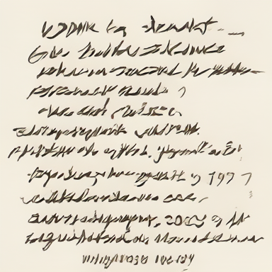</td>
      <td>⌠Almost totally failed.</td>
    </tr>
  </tbody>
</table>

#### Line Level
<table border="1" align="center" style="width: 100%; text-align: left;">
  <thead>
    <tr>
      <th>Prompt</th>
      <th>Language</th>
      <th>Method</th>
      <th>Output Image</th>
      <th>Assessment</th>
    </tr>
  </thead>
  <tbody>
    <tr>
      <td rowspan="4">Please generate an image with handwritten text that says: "OpenCV is open source, contains over 2500 algorithms, and is operated by the non-profit Open Source Vision Foundation." The handwriting style should be scribbled.</td>
      <td rowspan="4">EN</td>
      <td>GPT-4o</td>
      <td></td>
      <td>✅ Well done!</td>
    </tr>
    <tr>
      <td>Qwen-VLo</td>
      <td></td>
      <td>🤔 Partially correct but extra content is added.</td>
    </tr>
    <tr>
      <td>Flux.1-Kontext-Dev</td>
      <td>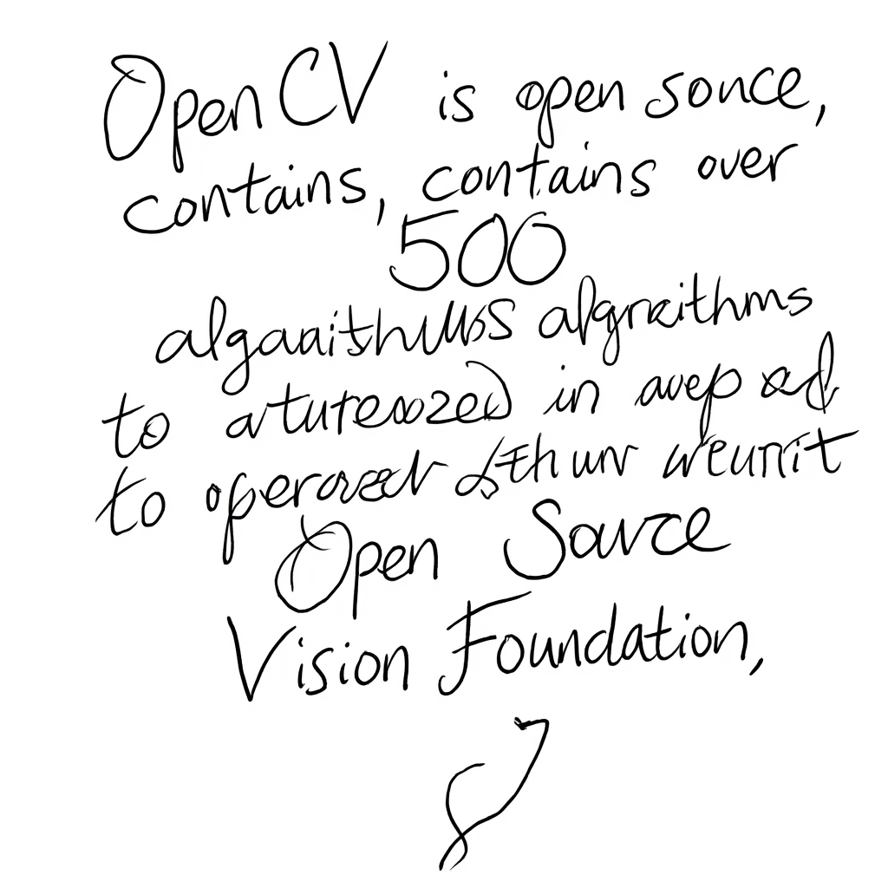</td>
      <td>🤔 Partially correct.</td>
    </tr>
    <tr>
      <td>Janus-4o</td>
      <td></td>
      <td>⌠Almost totally failed.</td>
    </tr>
  </tbody>
</table>

#### Character (Font) Level
<table border="1" align="center" style="width: 100%; text-align: left;">
  <thead>
    <tr>
      <th>Prompt</th>
      <th>Language</th>
      <th>Method</th>
      <th>Output Image</th>
      <th>Assessment</th>
    </tr>
  </thead>
  <tbody>
    <tr>
      <td rowspan="3">Please generate a handwritten character "P".</td>
      <td rowspan="3">EN</td>
      <td>GPT-4o</td>
      <td></td>
      <td>✅ Requirements fulfilled.</td>
    </tr>
    <tr>
      <td>Qwen-VLo</td>
      <td></td>
      <td>⌠Totally failed.</td>
    </tr>
    <tr>
      <td>Janus-4o</td>
      <td></td>
      <td>✅ Requirements fulfilled.</td>
    </tr>
    <tr>
      <td rowspan="3">生成一个手写汉字“天”，风格任意</td>
      <td rowspan="3">ZH</td>
      <td>GPT-4o</td>
      <td></td>
      <td>✅ Requirements fulfilled.</td>
    </tr>
    <tr>
      <td>Qwen-VLo</td>
      <td></td>
      <td>✅ Requirements fulfilled.</td>
    </tr>
    <tr>
      <td>Janus-4o</td>
      <td></td>
      <td>⌠Totally failed.</td>
    </tr>
  </tbody>
</table>

#### Interleaved Image-Text
<table border="1" align="center" style="width: 100%; text-align: left;">
  <thead>
    <tr>
      <th>Prompt</th>
      <th>Language</th>
      <th>Method</th>
      <th>Output Image</th>
      <th>Assessment</th>
    </tr>
  </thead>
  <tbody>
    <tr>
      <td rowspan="4">Generate a hand-drawn physics diagram illustrating the law of reflection: 1. A flat horizontal surface representing a mirror. 2. An incident ray approaching the surface at an angle, drawn with an arrow. 3. A reflected ray bouncing off the surface symmetrically, also with an arrow. 4. A normal line drawn perpendicular to the surface at the point of incidence. 5. Clear angle markings: the angle of incidence (labeled as θᵢ) and the angle of reflection (labeled as θᵣ) 6. Degree values annotated next to the angles (e.g., 45°). 7. Dashed lines used as angle guides (from rays to the normal). 8. All elements labeled with clean, handwriting-style text. 9. Overall style: hand-drawn, minimalistic, like a whiteboard or notebook sketch. 10. Background: plain white or paper texture; no photographic elements.</td>
      <td rowspan="4">EN</td>
      <td>GPT-4o</td>
      <td></td>
      <td>✅ Requirements fulfilled despite the vertical line shifts from the center.</td>
    </tr>
    <tr>
      <td>Qwen-VLo</td>
      <td></td>
      <td>⌠Almost totally failed.</td>
    </tr>
    <tr>
      <td>Flux.1-Kontext-Dev</td>
      <td></td>
      <td>🤔 Partially fulfilled. Prompt is too long and truncated to 77 tokens.</td>
    </tr>
    <tr>
      <td>Janus-4o</td>
      <td>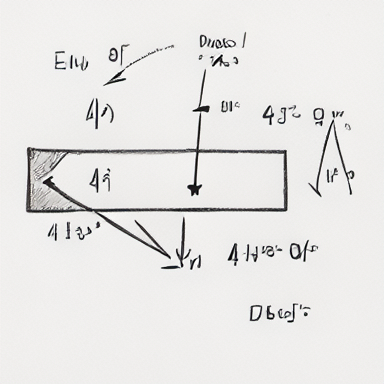</td>
      <td>⌠Almost totally failed.</td>
    </tr>
  </tbody>
</table>

### Text Editing

#### Page Level

<table border="1" align="center" style="width: 100%; text-align: left;">
  <thead>
    <tr>
      <th>Input Image</th>
      <th>Prompt</th>
      <th>Language</th>
      <th>Method</th>
      <th>Output Image</th>
      <th>Assessment</th>
    </tr>
  </thead>
  <tbody>
    <tr>
      <td rowspan="2"></td>
      <td rowspan="2">Erase text "Football, cricket, running" in this image.</td>
      <td rowspan="2">EN</td>
      <td>GPT-4o</td>
      <td></td>
      <td>⌠Text unedited. Light, drawings, and background color change.</td>
    </tr>
    <tr>
      <td>Qwen-VLo</td>
      <td></td>
      <td>⌠Some content has been mistakenly removed, and certain text has become unreadable.</td>
    </tr>
<tr>
  <td rowspan="2"></td>
  <td rowspan="2">Add an embossed word that reads “Sun rises.” in the appropriate place.</td>
  <td rowspan="2">EN</td>
  <td>GPT-4o</td>
  <td></td>
  <td>⌠Text is added but some text is cropped and image is cropped into a square format.</td>
</tr>
<tr>
  <td>Qwen-VLo</td>
  <td></td>
  <td>⌠Text is added, but some content is missing.</td>
</tr>

  </tbody>

#### Paragraph Level
<table border="1" align="center" style="width: 100%; text-align: left;">
  <thead>
    <tr>
      <th>Input Image</th>
      <th>Prompt</th>
      <th>Language</th>
      <th>Method</th>
      <th>Output Image</th>
      <th>Assessment</th>
    </tr>
  </thead>
  <tbody>
    <tr>
      <td rowspan="2"></td>
      <td rowspan="2">请将文字“演讲的力量”修改为“讲话的力量”。其他文字保持不变</td>
      <td rowspan="2">ZH</td>
      <td>GPT-4o</td>
      <td></td>
      <td>🤔 Partially correct. Modified successfully but the image becomes square and some texts are cropped.</td>
    </tr>
    <tr>
      <td>Qwen-VLo</td>
      <td></td>
      <td>🤔 Partially correct. Modified successfully but some texts are wrong.</td>
    </tr>
  </tbody>
</table>

#### Line Level
<table border="1" align="center" style="width: 100%; text-align: left;">
  <thead>
    <tr>
      <th>Input Image</th>
      <th>Prompt</th>
      <th>Language</th>
      <th>Method</th>
      <th>Output Image</th>
      <th>Assessment</th>
    </tr>
  </thead>
  <tbody>
    <tr>
      <td rowspan="2"></td>
      <td rowspan="2">Change "similarities" to "functionalities".</td>
      <td rowspan="2">EN</td>
      <td>GPT-4o</td>
      <td></td>
      <td>🤔 Partially correct. Modified successfully, but the image is squared, and some text is cropped. Clarity unexpectedly improve.</td>
    </tr>
    <tr>
      <td>Qwen-VLo</td>
      <td></td>
      <td>🤔 Partially correct. Modified successfully but most content is wrong.</td>
    </tr>
  </tbody>
</table><!-- Add other sections here similarly -->

### Handwritten Text Removal
#### Paragraph Leve
<table border="1" align="center" style="width: 100%; text-align: left;">
  <thead>
    <tr>
      <th>Input Image</th>
      <th>Prompt</th>
      <th>Language</th>
      <th>Method</th>
      <th>Output Image</th>
      <th>Assessment</th>
    </tr>
  </thead>
  <tbody>
    <tr>
      <td rowspan="2"></td>
      <td rowspan="2">请擦除这张图片中所有的手写笔迹</td>
      <td rowspan="2">ZH</td>
      <td>GPT-4o</td>
      <td></td>
      <td>⌠Totally failed.</td>
    </tr>
    <tr>
      <td>Qwen-VLo</td>
      <td></td>
      <td>⌠All things are removed.</td>
    </tr>
<tr>
  <td rowspan="2"></td>
  <td rowspan="2">将"高考加油鸭"这句话擦除</td>
  <td rowspan="2">ZH</td>
  <td>GPT-4o</td>
  <td></td>
  <td>🤔 Successful removal. But the image is squared. Clarity unexpectedly improve.</td>
</tr>
<tr>
  <td>Qwen-VLo</td>
  <td></td>
  <td>⌠All texts are removed.</td>
</tr>
<tr>
  <td rowspan="2"></td>
  <td rowspan="2">Remove all handwritten text in this image.</td>
  <td rowspan="2">EN</td>
  <td>GPT-4o</td>
  <td></td>
  <td>🤔 Successful removal. But the image is squared. Drawings unexpectedly change.</td>
</tr>
<tr>
  <td>Qwen-VLo</td>
  <td></td>
  <td>🤔 Successful removal but the color and objects are changed.</td>
</tr>

  <h2>📷Scene Text Image</h2>

### T2I Generation
<table border="1" align="center" style="width: 100%; text-align: left;">
  <thead>
    <tr>
      <th>Prompt</th>
      <th>Language</th>
      <th>Method</th>
      <th>Output Image</th>
      <th>Assessment</th>
    </tr>
  </thead>
  <tbody>
    <tr>
      <td rowspan="3">Create a street sign image with text "Tomorrow".</td>
      <td rowspan="3">EN</td>
      <td>GPT-4o</td>
      <td></td>
      <td>✅ Requirements fulfilled.</td>
    </tr>
    <tr>
      <td>Qwen-VLo</td>
      <td></td>
      <td>✅ Requirements fulfilled.</td>
    </tr>
    <tr>
      <td>Flux.1-Kontext-dev</td>
      <td></td>
      <td>✅ Requirements fulfilled.</td>
    </tr>
    <tr>
      <td rowspan="3">生成一个街上商店的招牌，内容是“超级市场”。</td>
      <td rowspan="3">ZH</td>
      <td>GPT-4o</td>
      <td></td>
      <td>✅ Requirements fulfilled.</td>
    </tr>
    <tr>
      <td>Qwen-VLo</td>
      <td></td>
      <td>✅ Requirements fulfilled.</td>
    </tr>
    <tr>
      <td>Flux.1-Kontext-dev</td>
      <td></td>
      <td>⌠I don’t know what is this.</td>
    </tr>
    <tr>
      <td rowspan="3">A bustling cyberpunk night market in a futuristic Asian metropolis, glowing with neon signs in multiple languages (Chinese, Japanese, Korean, Arabic, and English). The scene is filled with dense fog, reflections on wet pavement, flying cars above, and diverse crowds walking under neon umbrellas. Holographic advertisements float in the air, including a large glowing sign that reads "梦境集市" ("Dream Bazaar") in stylized Chinese calligraphy. Other floating signs display dynamic digital text such as "Now Open!", "未来食品", and "Quantum Noodles". The atmosphere is vibrant, chaotic, and immersive, with dramatic lighting and cinematic composition. Ultra-detailed, 4K, concept art style, with a blend of Blade Runner and Ghost in the Shell aesthetics.</td>
      <td rowspan="3">Mixed</td>
      <td>GPT-4o</td>
      <td></td>
      <td>✅ Most requirements fulfilled. High quality. But some Chinese texts are incorrect or lack semantic.</td>
    </tr>
    <tr>
      <td>Qwen-VLo</td>
      <td></td>
      <td>🤔 Partially fulfilled. But some texts are incorrect or lack semantic.</td>
    </tr>
    <tr>
      <td>Flux.1-Kontext-dev</td>
      <td></td>
      <td>🤔 Only style is correct. Text rendering failed.</td>
    </tr>
  </tbody>
</table>

### Text Editing
<table border="1" align="center" style="width: 100%; text-align: left;">
  <thead>
    <tr>
      <th>Input Image</th>
      <th>Prompt</th>
      <th>Language</th>
      <th>Method</th>
      <th>Output Image</th>
      <th>Assessment</th>
    </tr>
  </thead>
  <tbody>
    <tr>
      <td rowspan="3"></td>
      <td rowspan="3">Change "2011" to "3120" and "MAPLES" to "LEAF".</td>
      <td rowspan="3">EN</td>
      <td>GPT-4o</td>
      <td></td>
      <td>🤔 Partially good. Successful removal. However, the image is squared and color is unexpectedly brightened.</td>
    </tr>
    <tr>
      <td>Qwen-VLo</td>
      <td></td>
      <td>⌠Totally failed.</td>
    </tr>
    <tr>
      <td>Flux.1-Kontext-dev</td>
      <td></td>
      <td>⌠Though the appearance remains the same, the texts are mistakenly edited.</td>
    </tr>
  </tbody>
</table>

### Scene Text Removal

<table border="1" align="center" style="width: 100%; text-align: left;">
  <thead>
    <tr>
      <th>Prompt</th>
      <th>Input Image</th>
      <th>Language</th>
      <th>Method</th>
      <th>Output Image</th>
      <th>Assessment</th>
    </tr>
  </thead>
  <tbody>
    <tr>
      <td rowspan="3">Erase the "BEACH" in this image.</td>
      <td rowspan="3"></td>
      <td rowspan="3">EN</td>
      <td>GPT-4o</td>
      <td></td>
      <td>✅ Requirements fulfilled despite some details are lost.</td>
    </tr>
    <tr>
      <td>Qwen-VLo</td>
      <td></td>
      <td>🤔 Successful removal and original size maintainance. But texts are all removed.</td>
    </tr>
    <tr>
      <td>Flux.1-Kontext-Dev</td>
      <td>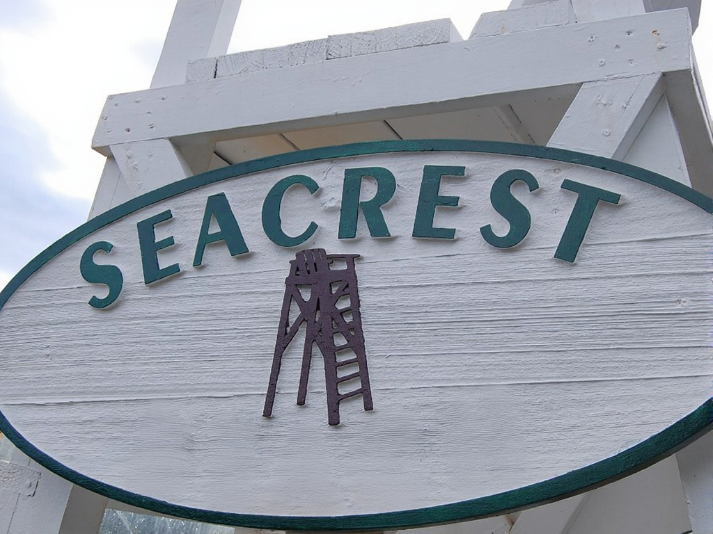</td>
      <td>🤔 Successful removal but notable traces. The image is unexpectedly squared.</td>
    </tr>
    <tr>
      <td rowspan="3">Erase all text in this image.</td>
      <td rowspan="3"></td>
      <td rowspan="3">EN</td>
      <td>GPT-4o</td>
      <td></td>
      <td>✅ Requirements fulfilled despite the image is squared.</td>
    </tr>
    <tr>
      <td>Qwen-VLo</td>
      <td></td>
      <td>🤔 Successful removal and original size maintainance. But the object is also removed.</td>
    </tr>
    <tr>
      <td>Flux.1-Kontext-Dev</td>
      <td></td>
      <td>🤔 Successful removal. The image is unexpectedly squared.</td>
    </tr>
  </tbody>
</table>

    <h2>🔤Object with Naturally Embedded Text</h2>

### T2I Generation
<table border="1" align="center" style="width: 100%; text-align: left;">
    <thead>
        <tr>
            <th>Prompt</th>
            <th>Lang.</th>
            <th>GPT-4o</th>
            <th>Assessment</th>
            <th>Qwen-VLo</th>
            <th>Assessment</th>
        </tr>
    </thead>
    <tbody>
        <tr>
            <td>一张古董木制学生尺子的特写照片。英寸和厘米的刻度应该精确且可读，数字和线条由于年代久远而略有褪色。尺子放在一本打开的教科书上，书页上的文字清晰可辨。图片需要为长方形。</td>
            <td>EN</td>
            <td>

</td>
            <td>⌠The generated ruler appears structurally correct but has flawed measurement markings (incorrect spacing/numbering).</td>
            <td>

</td>
            <td>⌠The generated ruler appears structurally correct but has unreadable measurement markings and texts.</td>
        </tr>
        <tr>
            <td>生成一张高度细节化的老式机械键盘的图像，键帽磨损。键帽上的字符应该清晰可辨，准确地反映QWERTY布局。键盘应显示使用痕迹，有灰尘和轻微变色。背景是一个凌乱的木制桌子。</td>
            <td>EN</td>
            <td>

</td>
            <td>⌠The keyboard's overall structure is correctly generated, but exhibits missing keycaps and contains incorrect legends on some remaining keycaps.</td>
            <td>

</td>
            <td>⌠The keyboard's overall structure is correctly generated but the texts on the keycaps are unreadable.</td>
        </tr>
        <tr>
            <td>Generate a photorealistic smartwatch with a high-resolution display showing authentic embedded UI elements. Feature a sleek metallic casing with subtle branding and precisely labeled buttons. The active screen should display clear time, health metrics and notifications with pixel-perfect readability. Ensure all text appears naturally integrated into the interface without artificial overlays. Include realistic material details like screen reflections and slight wear marks. Render in ultra HD with professional lighting for maximum realism.</td>
            <td>EN</td>
            <td>

</td>
            <td>✅ Most requirements fulfilled. High quality. But the brand SMRTWRCH may be incorrect.</td>
            <td>

</td>
            <td>⌠The overall structure is correctly generated but the texts are unreadable.</td>
        </tr>
        <tr>
            <td>生成一个饮料瓶，瓶身上印有中文品牌名、营养成分和生产日期，瓶身为透明塑料材质，有反光。</td>
            <td>ZH</td>
            <td>

</td>
            <td>🤔 Most requirements fulfilled. Some Chinese texts lack semantic.</td>
            <td>
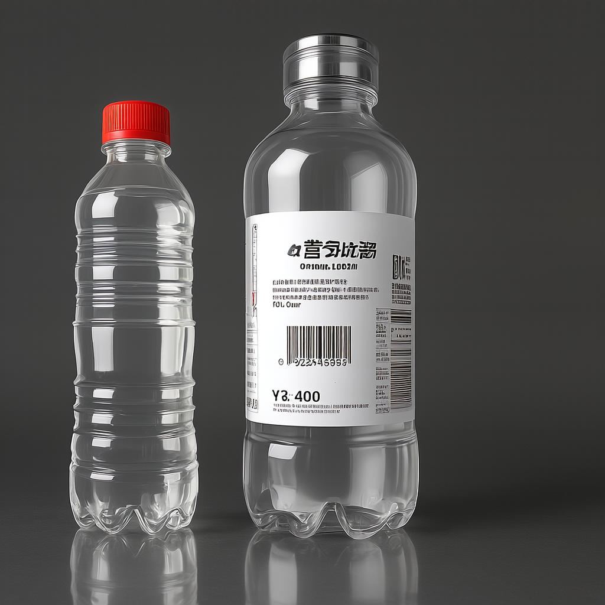
</td>
            <td>⌠Result contains two bottles instead of one, and the content on the bottle surfaces is unreadable.</td>
        </tr>
        <tr>
            <td>A smartphone back with the brand name 'TechFuture' subtly printed in a stylish font. The phone has a glossy finish and is reflecting light.</td>
            <td>EN</td>
            <td>

</td>
            <td>✅ Requirements fulfilled. High quality.</td>
            <td>

</td>
            <td>⌠The overall structure is correctly generated but the text is unreadable.</td>
        </tr>
        <tr>
            <td>A bicycle computer showing the speed and distance traveled in a digital font. The display reads '25.5 km/h' and '15.2 km'.</td>
            <td>EN</td>
            <td>

</td>
            <td>✅ Requirements fulfilled. High quality.</td>
            <td>

</td>
            <td>⌠The overall structure is correctly generated but the text is wrong.</td>
        </tr>
    </tbody>
</table>

### Text Editing
<table border="1" align="center" style="width: 100%; text-align: left;">
    <thead>
        <tr>
            <th>Input Image</th>
            <th>Prompt</th>
            <th>Lang.</th>
            <th>GPT-4o</th>
            <th>Assessment</th>
            <th>Qwen-VLo</th>
            <th>Assessment</th>
        </tr>
    </thead>
    <tbody>
        <tr>
            <td>

</td>
            <td>Adjust the dashboard to show a speed of 60 km/h with the speedometer needle correctly positioned. Also, set the tachometer to a realistic RPM for that speed, like 2000 RPM, ensuring the vehicle's status appears consistent and accurate.</td>
            <td>Mixed</td>
            <td>

</td>
            <td>🤔 Partially good: the speed is correct at 60 km/h, but there are text errors, an incorrect speedometer needle, and additional unintended changes.</td>
            <td>

</td>
            <td>🤔 Partially good: the speed is correct at 60 km/h, but there are text errors, an incorrect speedometer needle, and additional unintended changes.</td>
        </tr>
        <tr>
            <td>

</td>
            <td>将0改成7，“冷藏”改成“风速”</td>
            <td>ZH</td>
            <td>

</td>
            <td>🤔 Partially good. The number is correctly modified while the Chinese text is not. Other text are not precisely retained.</td>
            <td>

</td>
            <td>⌠The text is not modified correctly, a large amount of additional content is changed, and some text is unreadable.</td>
        </tr>
        <tr>
            <td>

</td>
            <td>Modify "F5.6" to "OK.8" and "ONE" to "FOUR"</td>
            <td>EN</td>
            <td>

</td>
            <td>🤔 Partially good. Correct modification. But the image is accidentally squared.</td>
            <td>

</td>
            <td>🤔 Partially good. The text changes are correct, but a large amount of additional content has been modified.</td>
        </tr>
    </tbody>
</table>
<!-- Artistic Text Image -->

    <h2>:rainbow:Artistic Text Image</h2>

### T2I Generation
#### Line Level

<table border="1" align="center" style="width: 100%; text-align: left;">
    <thead>
        <tr>
            <th>Prompt</th>
            <th>Lang.</th>
            <th>GPT-4o</th>
            <th>Assessment</th>
            <th>Qwen-VLo</th>
            <th>Assessment</th>
        </tr>
    </thead>
    <tbody>
        <tr>
            <td>Generate a line of artistic text with intricate details, creative typography, and visual appeal, ensuring that each character has a different color. The font should have a unique aesthetic, incorporating elegant curves, bold strokes, or decorative elements. The text content should be: 'OpenCV is open source, contains over 2500 algorithms, and is operated by the non-profit Open Source Vision Foundation.'</td>
            <td>EN</td>
            <td>

</td>
            <td>🤔 Partially good. Some texts are incorrect.</td>
            <td>

</td>
            <td>⌠Most of the text content is missing or incomplete.</td>
        </tr>
        <tr>
            <td>生成一行具有复杂细节、创意排版和视觉吸引力的艺术文本，要求每一个文字的颜色都不相同，字体应具有独特的美感，融入优雅的曲线、粗犷的笔触或装饰元素。文本的内容为“生活就像海洋，只有意志坚强的人才能到达彼岸”。</td>
            <td>ZH</td>
            <td>

</td>
            <td>🤔 Partially good. Some texts are incorrect.</td>
            <td>

</td>
            <td>⌠Most of the text content is missing or incomplete.</td>
        </tr>
        <tr>
            <td>生成一行具有复杂细节、创意排版和视觉吸引力的艺术文本，要求每一个文字的颜色都不相同，字体应具有独特的美感，融入优雅的曲线、粗犷的笔触或装饰元素。文本的内容为“龒厵䨫巴邑䶕脀勧忄”。</td>
            <td>ZH</td>
            <td>

</td>
            <td>⌠Totally failed. Unable to handle complex Chinese text.</td>
            <td>

</td>
            <td>⌠Totally failed. Unable to handle complex Chinese text.</td>
        </tr>
    </tbody>
</table>

#### Character (Font) Level

<table border="1" align="center" style="width: 100%; text-align: left;">
    <thead>
        <tr>
            <th>Prompt</th>
            <th>Lang.</th>
            <th>GPT-4o</th>
            <th>Assessment</th>
            <th>Qwen-VLo</th>
            <th>Assessment</th>
            <th>Flux.1-Kontext-Dev</th>
            <th>Assessment</th>
            <th>Janus-4o</th>
            <th>Assessment</th>
        </tr>
    </thead>
    <tbody>
        <tr>
            <td>Please generate an artistic font "A".</td>
            <td>EN</td>
            <td>

</td>
            <td>✅ Requirements fulfilled.</td>
            <td>

</td>
            <td>✅ Requirements fulfilled.</td>
            <td>

</td>
            <td>🤔 Partially correct.</td>
            <td>
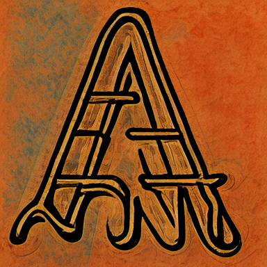
</td>
            <td>✅ Requirements fulfilled.</td>
        </tr>
        <tr>
            <td>请生成一个艺术字，内容为“瀧”。</td>
            <td>ZH</td>
            <td>

</td>
            <td>⌠Totally failed. Unable to handle complex Chinese text.</td>
            <td>
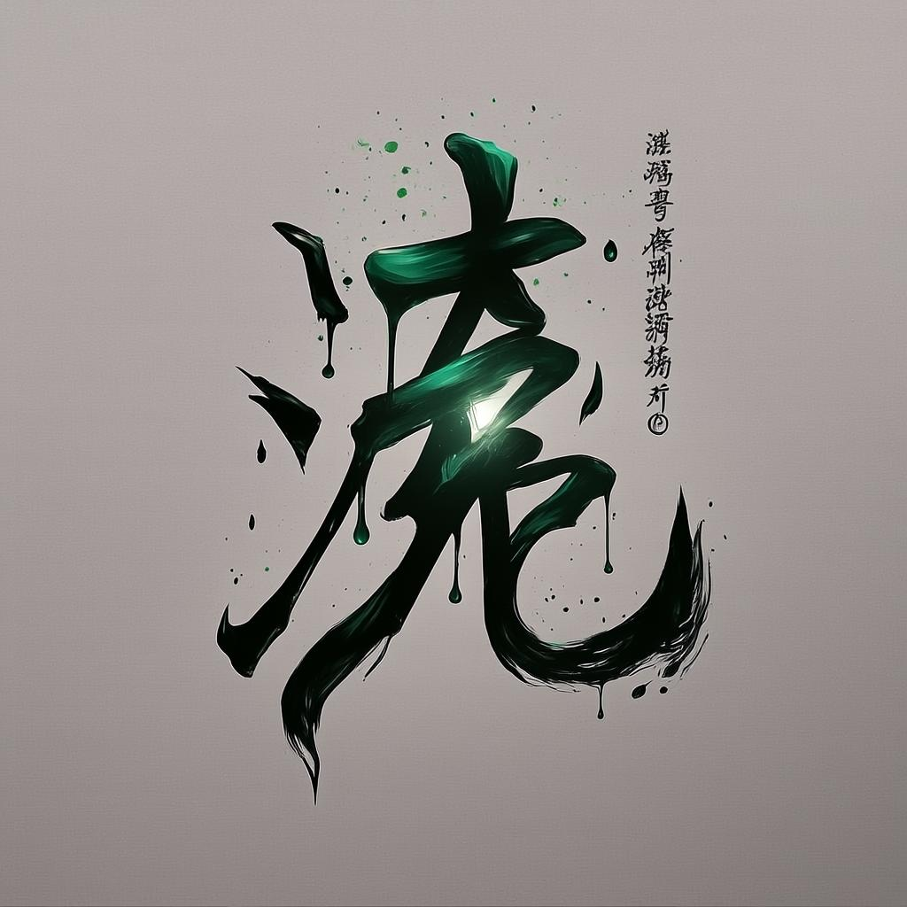
</td>
            <td>⌠Totally failed.</td>
            <td>

</td>
            <td>⌠Totally failed.</td>
            <td>

</td>
            <td>⌠Totally failed. Unable to handle Chinese text.</td>
        </tr>
    </tbody>
</table>

### Style Transfer
<table border="1" align="center" style="width: 100%; text-align: left;">
    <thead>
        <tr>
            <th>Input Image</th>
            <th>Prompt</th>
            <th>Lang.</th>
            <th>GPT-4o</th>
            <th>Assessment</th>
            <th>Qwen-VLo</th>
            <th>Assessment</th>
        </tr>
    </thead>
    <tbody>
        <tr>
            <td>

</td>
            <td>参照图中的汉字风格，生成“一起去旅行”这句话</td>
            <td>ZH</td>
            <td>

</td>
            <td>✅ Requirements fulfilled.</td>
            <td>

</td>
            <td>🤔 Some texts are wrong.</td>
        </tr>
        <tr>
            <td>

</td>
            <td>参照图中的汉字风格，生成“一起去旅行”这句话</td>
            <td>ZH</td>
            <td>

</td>
            <td>✅ Requirements fulfilled.</td>
            <td>

</td>
            <td>⌠Totally failed.</td>
        </tr>
        <tr>
            <td>

</td>
            <td>Refer to the text style of this image, create an image with text “You are welcome”</td>
            <td>EN</td>
            <td>

</td>
            <td>✅ Requirements fulfilled.</td>
            <td>

</td>
            <td>🤔 Additional texts are generated.</td>
        </tr>
    </tbody>
</table>

<!-- Layout-aware Text Generation -->

    <h2>🕌Layout-aware Text Generation</h2>

<table border="1" align="center" style="width: 100%; text-align: left;">
    <thead>
        <tr>
            <th>Input Image</th>
            <th>Prompt</th>
            <th>Lang.</th>
            <th>GPT-4o</th>
            <th>Assessment</th>
            <th>Qwen-vlo</th>
            <th>Assessment</th>
            <th>Flux.1-Kontext-dev</th>
            <th>Assessment</th>
        </tr>
    </thead>
    <tbody>
        <tr>
            <td>

</td>
            <td>Add text “Good coffee” in appropriate position with layout awareness.</td>
            <td>EN</td>
            <td>

</td>
            <td>⌠Text is correct but coffee’s position is changed. Objects are not preserved.</td>
            <td>

</td>
            <td>✅ Requirements fulfilled.</td>
            <td>

</td>
            <td>⌠Text is not correct. Image is squared.</td>
        </tr>
        <tr>
            <td>

</td>
            <td>Add text “Camera is good” in appropriate position with layout awareness.</td>
            <td>EN</td>
            <td>

</td>
            <td>✅ Requirements fulfilled despite slight change on the text of camera.</td>
            <td>

</td>
            <td>⌠Text is incorrect.</td>
            <td>
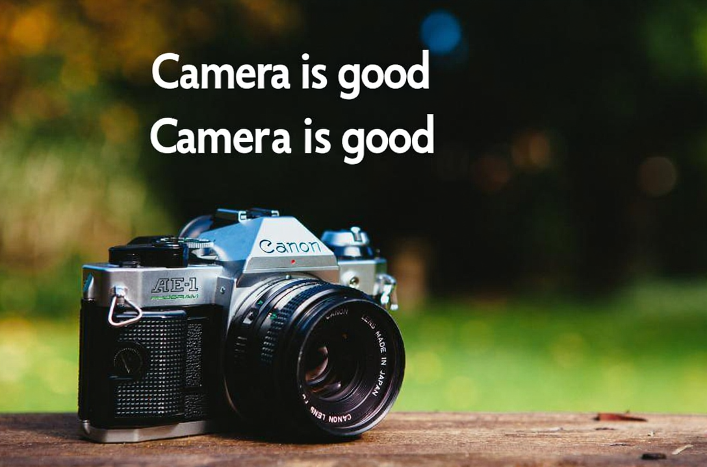
</td>
            <td>⌠Text is not correct. Image is squared.</td>
        </tr>
    </tbody>
</table>

## 
:e-mail:Contact
 <!-- omit in toc -->

eeprzhang@mail.scut.edu.cn

## 
🌊Acknowledgement<!-- omit in toc -->

[Peirong Zhang](https://github.com/NiceRingNode), [Haowei Xu](https://github.com/shallweiwei), [Guitao Xu](https://github.com/guitaoxu).

Copyright 2025, [Deep Learning and Vision Computing (DLVC) Lab](http://www.dlvc-lab.net), South China China University of Technology.
